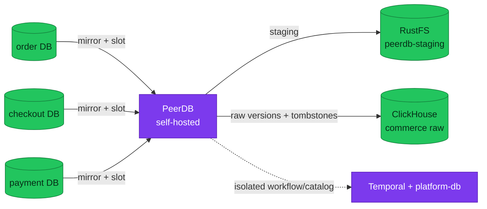

# ADR-066: Adopt PeerDB for Commerce CDC

> **Decision summary:** We will self-host PeerDB as the PostgreSQL-to-ClickHouse
> CDC transport for Backoffice commerce analytics because it owns snapshot,
> checkpoint, update, and delete capture without introducing a broker. We accept
> a new stateful control plane, logical-slot WAL risk, and a version and licence
> qualification gate in exchange for not owning a bespoke transport.

| Attribute | Value |
|-----------|-------|
| **Status** | Accepted |
| **Decision date** | 2026-09-09 |
| **Owners** | `duynhne` |
| **Deciders** | `duynhne` |
| **Scope** | The transport and control-plane boundary from the three commerce PostgreSQL databases to ClickHouse |
| **Affected components** | `product-db`; PeerDB; the `peerdb` Temporal namespace; the `peerdb-staging` RustFS bucket; the PeerDB catalog on `platform-db`; ClickHouse commerce raw tables |
| **Related RFC** | [RFC-0030](../../rfc/RFC-0030/) |
| **Related research** | [research.md](../../rfc/RFC-0030/research.md) |
| **Supersedes** | — |
| **Superseded by** | — |
| **Implementation tracking** | RFC-0030 rollout and acceptance gates |
| **Adoption** | Not started |

## Context

The Backoffice needs joined order, checkout, and payment facts for bounded
analytics. Those facts live in three databases on the same CloudNativePG
cluster, and none of the transactional services owns the cross-domain read
model. ClickHouse is already the platform OLAP store, but no commerce tables or
transport exist.

A custom batch would make the platform define initial-copy boundaries,
watermarks, overlap, retries, updates, and deletes. Continuous CDC avoids that
second transport implementation, but creates a consumer slot whose retained WAL
can endanger the source and a stateful runtime that must recover correctly.

## Scope

### In scope

- The CDC product and one-mirror-per-database topology.
- Placement and isolation of PeerDB's catalog, workflow, and staging state.
- Source connection and failure containment rules.

### Out of scope

- Source column authorization, decided by ADR-067.
- Freshness heartbeat scheduling, decided by ADR-068.
- Commerce metric semantics, ClickHouse DDL, and the consumer API.
- A general event backbone for application integration.

## Decision drivers

| Priority | Driver | Why it matters |
|---------:|--------|----------------|
| 1 | Correct update and delete capture | Financial and funnel views cannot silently retain superseded state |
| 2 | Bounded source blast radius | A stalled consumer must not exhaust PostgreSQL storage or block transactions |
| 3 | Avoid owning transport internals | Snapshot, checkpoint, type mapping, and retry are not product differentiators |
| 4 | Operational isolation | Shared platform dependencies must not imply shared credentials or failure domains |
| 5 | Reversibility | A failed prototype must permit a clean return to the batch option |

## Decision

We will self-host PeerDB for PostgreSQL-to-ClickHouse CDC. We will run three
independent mirrors in rollout order `order`, `checkout`, then `payment`; each
mirror owns one source database connection, publication, logical slot, and
destination mapping.

PeerDB will connect with TLS to `product-db-rw.product.svc:5432`. Logical
decoding will never traverse PgDog or a read-only Service. PeerDB may reuse the
existing Temporal, RustFS, and `platform-db` capabilities only through a
dedicated `peerdb` namespace, `peerdb-staging` bucket and identity, and catalog
database and role. PeerDB control APIs and UI stay cluster-internal.

### Decision rules

| Rule | Required behavior |
|------|-------------------|
| **Transport ownership** | PeerDB owns snapshot, WAL consumption, checkpoints, staging, retries, and ClickHouse delivery; platform code must not implement a second CDC loop |
| **Mirror isolation** | `order`, `checkout`, and `payment` use separate mirrors, publications, slots, credentials, and source health |
| **Source path** | Mirrors connect directly to the CNPG read-write Service with TLS, never PgDog or a replica Service |
| **Dependency isolation** | PeerDB receives dedicated Temporal namespace, RustFS identity/bucket, and catalog database/role |
| **Failure behavior** | Finite retained-WAL limits protect PostgreSQL; invalidated or unsafe slots require an explicit resync decision rather than an improvised retry |
| **Rollback** | Pause mirrors and preserve evidence and slots first; never run batch and PeerDB as parallel production transports |

### Decision view

## Alternatives considered

| Option | Benefits | Costs / risks | Result |
|--------|----------|---------------|--------|
| **A — Self-hosted PeerDB** | Purpose-built snapshot and CDC, update/delete capture, no broker | New control plane, logical slots, full snapshots, licence and version qualification | Selected |
| **B — Custom bounded batch** | Smaller infrastructure footprint | Platform owns watermarks, overlap, retries, updates, deletes, and recovery | Rejected fallback unless the prototype fails |
| **C — Debezium plus Kafka/Redpanda** | Mature general-purpose event backbone and replay | Broker, Connect, topics, schemas, ordering, and on-call surface for one consumer | Rejected |
| **D — Custom `pgoutput` consumer** | Maximum control | Permanent decoding, checkpoint, mapping, and support ownership | Rejected |
| **E — ClickHouse `MaterializedPostgreSQL`** | Fewer components | Experimental and DDL limitations below the platform production bar | Rejected |
| **F — Service export APIs** | Preserves service boundaries | Three bulk APIs, repeated serialization, and transactional-service load | Rejected |

### Why the selected option won

PeerDB is the narrowest option that removes transport correctness from
application code while retaining continuous updates and deletes. It also fits
the existing PostgreSQL, Temporal, RustFS, and ClickHouse stack without creating
a general-purpose event platform.

### Why the closest alternative lost

Batch is operationally smaller, but its simplicity ends at the first update,
delete, retry, or interrupted initial copy. Those cases are the transport. A
home-grown batch therefore saves pods by transferring the harder state machine
to platform-owned code.

## Consequences

### Positive consequences

- Transactional services remain independent of analytics availability.
- Snapshot, checkpoint, update, and delete behavior have one explicit owner.
- Each lagging source can be diagnosed or paused independently.

### Negative consequences and accepted trade-offs

- PeerDB, its catalog, workflows, staging, and upgrades become day-2 platform work.
- Consumer lag retains WAL and can force a destructive resync after the safety cap.
- Initial snapshots consume source, network, staging, and ClickHouse capacity.
- AGPL-3.0 core and the ELv2 chart require explicit approval before acceptance.
- Schema evolution remains conservative until the pinned build proves exact behavior.

### Neutral consequences

- Commerce CDC is an analytical integration path, not an application event bus.
- ClickHouse stores independently versioned raw rows and tombstones before serving normalization.

## Implementation obligations

| Obligation | Owner | Tracking | Completion signal |
|------------|-------|----------|-------------------|
| Pin and review a compatible PeerDB core and deployment artifact | Platform | RFC-0030 prototype | Digests and licence decision recorded; clean install passes |
| Declare isolated catalog, workflow, staging, secrets, and network paths | Platform | RFC-0030 rollout | No PeerDB identity can access adjacent platform state |
| Size slots, WAL senders, retained WAL, storage, and resource floor | Platform / Database | RFC-0030 source-safety gate | Measured thresholds and finite WAL cap are committed |
| Prove three mirrors and recovery | Platform | RFC-0030 correctness gate | Snapshot and CDC tests pass through restart, outage, and resync |
| Add alerts, dashboard, and runbook | Platform / Observability | RFC-0030 close-out | Lag, slot, staging, dependency, and resync paths are operable |

## Validation and compliance

| Requirement | Verification |
|-------------|--------------|
| Update/delete correctness | Concurrent snapshot plus insert/update/delete/tombstone and duplicate-delivery tests |
| Independent mirrors | Stop each mirror and prove only its source freshness degrades |
| Source safety | Network-partition and dependency-outage drills keep retained WAL within the configured cap |
| Recovery | PeerDB restart, CNPG switchover/failover, WAL invalidation, and explicit resync drills |
| Isolation | Positive and negative credential, HBA, TLS, NetworkPolicy, catalog, and bucket tests |
| Capacity | One-million-fact load measures snapshot duration, WAL, staging, raw storage, CPU, and memory |

## Revisit triggers

Re-open this decision when one or more of the following become true:

- PeerDB fails any RFC-0030 hard prototype gate on the pinned build.
- Licence terms cannot be approved for the selected deployment artifact.
- Retained WAL or source load cannot be bounded without harming transactions.
- More independent consumers require replay and schema governance that justify a broker.
- Schema changes repeatedly require full resync beyond the accepted operational budget.

A changed decision requires a new ADR that supersedes this one.

## References

- [RFC-0030](../../rfc/RFC-0030/)
- [RFC-0030 research](../../rfc/RFC-0030/research.md)
- [ClickHouse platform guide](../../../observability/clickhouse/README.md)
- [Database architecture](../../../databases/architecture.md)

## History

| Date | Status / adoption | Change |
|------|-------------------|--------|
| 2026-09-09 | Proposed / Not started | Initial decision drafted during RFC-0030 architecture review |
| 2026-09-09 | Accepted / Not started | Owner accepted the architecture; qualification remains Phase 0 of implementation |

---
_Last updated: 2026-09-09._
