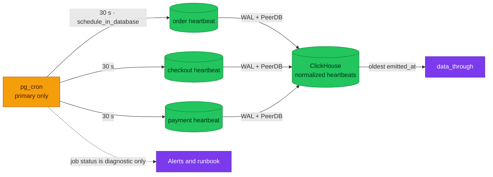

# ADR-068: Schedule CDC Freshness Heartbeats with pg_cron

> **Decision summary:** We will schedule source-local CDC freshness heartbeats
> with `pg_cron` because the freshness authority must traverse the complete idle
> source-to-ClickHouse path without adding a single-purpose network workload. We
> accept a custom CNPG image, preload restart, background-worker capacity, and
> restore/failover duties in exchange for removing an external credential and
> connection path.

| Attribute | Value |
|-----------|-------|
| **Status** | Proposed |
| **Decision date** | — |
| **Owners** | `duynhne` |
| **Deciders** | `duynhne` |
| **Scope** | Scheduling and operating the RFC-0030 source heartbeat on the `product-db` CNPG cluster |
| **Affected components** | Custom PostgreSQL 18 system image; `product-db`; `product-db-replica`; restore path; `pg_cron`; three heartbeat tables and jobs; monitoring and runbook |
| **Related RFC** | [RFC-0030](../../rfc/RFC-0030/) |
| **Related research** | [research.md](../../rfc/RFC-0030/research.md) |
| **Supersedes** | — |
| **Superseded by** | — |
| **Implementation tracking** | RFC-0030 extension-safety and freshness gates |
| **Adoption** | Not started |

## Context

Mirror status proves control-plane state, not that a source change reached
ClickHouse. The newest business row is also insufficient because a healthy
source can be idle. RFC-0030 therefore needs a low-cost change in each source
database whose source timestamp is measured only after normalization in
ClickHouse.

PeerDB's documented built-in heartbeat interval is twelve minutes, above the
two-minute freshness objective. An external writer could update the rows more
often, but would add a workload, image, credential, HBA rule, and network path
whose only purpose is three fixed-row updates.

The deployed CNPG operand image does not contain `pg_cron`. Preloading a missing
library can prevent PostgreSQL startup, and extension files must remain
available on standbys, restored clusters, and the DR cluster.

## Scope

### In scope

- Delivery, preload, activation, execution, and cleanup of `pg_cron`.
- The heartbeat role, tables, cadence, and freshness authority.
- Restart, restore, promotion, and rollback rules.

### Out of scope

- PeerDB transport selection, decided by ADR-066.
- General application job scheduling.
- Business-table writes or database maintenance jobs.
- Exact analytics API response fields.

## Decision drivers

| Priority | Driver | Why it matters |
|---------:|--------|----------------|
| 1 | End-to-end freshness truth | Idle traffic must still prove source → WAL → PeerDB → ClickHouse progress |
| 2 | Database availability | A missing preload artifact must never be discovered during the production restart |
| 3 | Least privilege | Heartbeats must not create a remote writer credential or broaden application roles |
| 4 | Promotion and restore safety | Scheduling must follow the writable primary and survive recovery |
| 5 | Low operational surface | The mechanism performs only three bounded fixed-row updates |

## Decision

We will package `postgresql-18-cron` in a digest-pinned custom system image
derived from the deployed PostgreSQL 18.1 system image. The compatible image
will be proven on `product-db-replica`, restore, and every primary/standby before
`pg_cron` is added to CNPG's dedicated `shared_preload_libraries` field.

We will activate `pg_cron` only in the cluster's `postgres` database, use UTC
and background workers, disable superuser job execution, and cap concurrent
jobs. One cluster-wide, non-owning `analytics_heartbeat` role may update only
the three database-local `analytics_cdc_heartbeat` tables.

Three named `cron.schedule_in_database()` jobs will run every 30 seconds and
upsert the fixed row with `clock_timestamp()`. One daily job will retain seven
days of `cron.job_run_details`. Freshness is the oldest of the three timestamps
observed in normalized ClickHouse data; scheduler success is diagnostic only.

### Decision rules

| Rule | Required behavior |
|------|-------------------|
| **Artifact first** | Verify the library, control file, SQL files, architecture, PostgreSQL version, restore, and rollback before changing preload |
| **Activation** | Install extension metadata only in `postgres`; use `schedule_in_database()` for `order`, `checkout`, and `payment` |
| **Execution identity** | `analytics_heartbeat` is non-owning and may modify only the three technical tables; application and PeerDB roles receive no cron administration |
| **Cadence and clock** | Named jobs run every 30 seconds in UTC and write `clock_timestamp()` to one fixed row per source |
| **Freshness authority** | Only the timestamp observed after ClickHouse normalization proves progress; cron and mirror status cannot advance `data_through` |
| **Failure behavior** | Scheduler, worker, or promotion failure raises lag, then stale and unavailable responses; it never affects transactional writes |
| **Rollback** | Disable new launches first and preserve image, preload, metadata, and run history during diagnosis; removal is a separately reviewed restart |

### Decision view

## Alternatives considered

| Option | Benefits | Costs / risks | Result |
|--------|----------|---------------|--------|
| **A — `pg_cron` source-local jobs** | Server clock, primary-only scheduling, no remote credential or network workload | Custom image, preload, workers, restart, restore, and promotion lifecycle | Selected |
| **B — External heartbeat Deployment** | No PostgreSQL extension; familiar Kubernetes lifecycle | New image, credential, HBA, NetworkPolicy, connection, and HA behavior for three updates | Rejected fallback if the extension gate fails |
| **C — PeerDB built-in heartbeat** | No source object or scheduler | Documented twelve-minute interval cannot meet the two-minute objective | Rejected |
| **D — Newest business row** | No technical writes | Idle sources look stale and recent rows can be stuck before ClickHouse | Rejected |
| **E — PeerDB mirror status** | Cheap control-plane query | Does not prove target progress or normalization | Rejected |

### Why the selected option won

`pg_cron` creates the required source change using the PostgreSQL server clock
and follows the writable primary without adding a remote identity. Its change
then traverses exactly the same WAL, PeerDB, staging, and ClickHouse path as the
business facts being measured.

### Why the closest alternative lost

The external writer avoids extension lifecycle risk, but creates an entire
networked runtime and secret lifecycle for a deterministic database-local
operation. It remains the explicit fallback because it is preferable if the
custom image, restore, worker-capacity, or promotion proof fails.

## Consequences

### Positive consequences

- Idle and busy streams use the same target-observed freshness authority.
- No external heartbeat password, HBA pair, network path, or pod is required.
- Heartbeat failure degrades analytics without entering a transactional request path.
- Named jobs and bounded history make execution auditable.

### Negative consequences and accepted trade-offs

- The platform must build, scan, pin, upgrade, and restore a custom CNPG image.
- Preload changes restart PostgreSQL and a missing library can block startup.
- Background workers consume finite cluster capacity.
- Extension metadata, jobs, privileges, and history cleanup require reconciliation.

### Neutral consequences

- The same compatible image remains on the operational, DR, and restore paths even when only the primary launches jobs.
- `pg_cron` is a supporting signal mechanism; it does not replace CDC or analytics processing.

## Implementation obligations

| Obligation | Owner | Tracking | Completion signal |
|------------|-------|----------|-------------------|
| Build, scan, and pin the compatible system image | Platform / Database | RFC-0030 prototype | Artifact and `pg_available_extensions` checks pass on the exact digest |
| Prove image and preload lifecycle | Platform / Database | RFC-0030 extension-safety gate | Replica-first rollout, restart, restore, rollback, switchover, and failover pass |
| Reconcile extension, role, tables, jobs, and cleanup | Platform / Database | RFC-0030 source-safety gate | Desired objects and exact ACLs exist once and survive reconciliation |
| Add scheduler and capacity telemetry | Observability | RFC-0030 close-out | Job result, duration, last completion, history growth, and worker headroom are visible |
| Write the failure runbook | Platform / Database | RFC-0030 close-out | On-call can distinguish scheduler, worker, CDC, staging, and target failures |

## Validation and compliance

| Requirement | Verification |
|-------------|--------------|
| Artifact safety | Inspect library/control/SQL files and start every primary/standby/restored pod from the pinned image |
| Least privilege | Heartbeat role updates only fixed technical rows and cannot read or write business tables or administer unrelated jobs |
| Primary-only execution | Planned switchover and unplanned failover produce one active scheduler without overlapping writers |
| Freshness | Idle, busy, restart, and recovery tests keep target-observed lag at or below two minutes |
| Failure contract | Disabled job or exhausted workers produce stale state through five minutes and `503` beyond five minutes or when unknown |
| Bounded history | Daily cleanup retains seven days without unbounded `cron.job_run_details` growth |

## Revisit triggers

Re-open this decision when one or more of the following become true:

- The custom image cannot pass PostgreSQL 18, architecture, restore, or rollback gates.
- CNPG promotion produces overlapping jobs or an unacceptable heartbeat gap.
- Background-worker headroom cannot be bounded safely.
- A supported built-in PeerDB heartbeat meets the two-minute objective.
- Platform policy eliminates custom PostgreSQL system images.

A changed decision requires a new ADR that supersedes this one.

## References

- [RFC-0030](../../rfc/RFC-0030/)
- [RFC-0030 research](../../rfc/RFC-0030/research.md)
- [PostgreSQL extension policy](../../../databases/extensions.md)
- [`pg_cron`](https://github.com/citusdata/pg_cron)
- [CloudNativePG shared preload configuration](https://cloudnative-pg.io/docs/1.30/postgresql_conf/#shared-preload-libraries)

## History

| Date | Status / adoption | Change |
|------|-------------------|--------|
| 2026-09-09 | Proposed / Not started | Initial decision drafted during RFC-0030 architecture review |

---
_Last updated: 2026-09-09._
