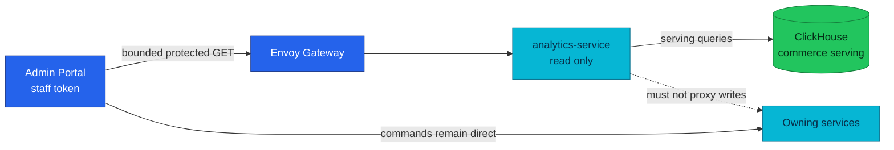

# ADR-069: Serve Commerce Analytics through a Read-Only Service

> **Decision summary:** We will expose Backoffice commerce analytics through a
> thin read-only `analytics-service` because the browser needs one governed
> cross-domain result without ClickHouse credentials or metric logic. We accept
> one new service and protected route in exchange for keeping commands on their
> owning services and analytical storage behind a stable trust boundary.

| Attribute | Value |
|-----------|-------|
| **Status** | Proposed |
| **Decision date** | — |
| **Owners** | `duynhne` |
| **Deciders** | `duynhne` |
| **Scope** | The serving boundary between ClickHouse commerce views and the Backoffice Admin Portal |
| **Affected components** | New `analytics-service` repository and deployment; ClickHouse read identity; Envoy Gateway protected route; Admin Portal analytics page; API contracts and observability |
| **Related RFC** | [RFC-0030](../../rfc/RFC-0030/) |
| **Related research** | [research.md](../../rfc/RFC-0030/research.md) |
| **Supersedes** | — |
| **Superseded by** | — |
| **Implementation tracking** | RFC-0030 dark-launch and consumer rollout |
| **Adoption** | Not started |

## Context

ADR-048 deliberately kept the Admin Portal as a static SPA that calls owning
services directly. It named a read-only aggregator as the escape hatch when a
screen genuinely requires cross-domain joins. Commerce analytics now needs one
answer derived from order, checkout, and payment facts, so three direct browser
queries cannot produce authoritative metrics or one freshness decision.

ClickHouse is an internal analytical store. Giving its credential or arbitrary
SQL to a browser would expose raw storage, couple the UI to physical schemas,
and move money/funnel semantics into presentation code. Adding analytics reads
to a transactional service would assign cross-domain data and availability to
a component that does not own them.

## Scope

### In scope

- The read-only aggregation service and its trust, data, and failure boundaries.
- One bounded protected commerce-overview operation.
- The relationship to ADR-048 and direct command routing.

### Out of scope

- Any command, mutation, business invariant, or transactional write.
- Generic SQL, report builders, exports, or arbitrary dimensions.
- PeerDB control APIs and ClickHouse raw-table access.
- The Admin page's visual implementation details.

## Decision drivers

| Priority | Driver | Why it matters |
|---------:|--------|----------------|
| 1 | Preserve business ownership | Analytics must never become a second command or transactional write path |
| 2 | Protect analytical storage | Browsers must not receive ClickHouse credentials or arbitrary query capability |
| 3 | One metric and freshness authority | Money, funnel, tombstone, and staleness semantics must not be reimplemented in the UI |
| 4 | Bounded interface | One reviewed operation is easier to secure and operate than a generic analytics API |
| 5 | Independent failure | Analytics outages must not enter checkout, order, or payment error budgets |

## Decision

We will add a thin, read-only `analytics-service` as the aggregation escape
hatch anticipated by ADR-048. It will own no business data and will query only
reviewed ClickHouse serving objects through a read-only identity. It receives no
source, catalog, staging, PeerDB-control, or ClickHouse-write credential.

Its initial public surface is one bounded operation:

```text
GET /analytics/v1/protected/commerce/overview?currency=USD&from=YYYY-MM-DD&to=YYYY-MM-DD
```

The service will enforce the staff issuer and `backoffice_admin`, reject
unbounded intervals and arbitrary SQL/columns, and return metric values with
`generated_at`, `data_through`, `stale`, and source-level health. Two-to-five
minutes of lag is explicitly stale; more than five minutes or unknown freshness
returns `503` rather than a plausible zero.

Admin commands continue directly through the edge to their owning services.
The protected analytics route and portal navigation remain absent until the
service passes dark-launch correctness, authorization, freshness, and failure
gates.

### Decision rules

| Rule | Required behavior |
|------|-------------------|
| **Ownership** | `analytics-service` owns query composition and response semantics, but no business state or invariant |
| **Write path** | No business mutation, command proxy, source write, or ClickHouse write is permitted |
| **Read path** | The service reads only reviewed serving objects with a dedicated read-only ClickHouse identity |
| **Consumer trust** | Browser access goes through the protected edge route with staff issuer and `backoffice_admin`; no database credentials reach the browser |
| **Failure behavior** | Stale and unknown data are explicit; the service never fabricates freshness or converts an unavailable pipeline into zero |
| **Compatibility** | Commands remain direct under ADR-048; exact payload becomes authoritative in `docs/api/analytics.md` only after implementation |

### Decision view



## Alternatives considered

| Option | Benefits | Costs / risks | Result |
|--------|----------|---------------|--------|
| **A — Thin read-only analytics service** | One governed contract, server-side semantics, no browser DB credential | New service, route, deployment, SLO, and on-call surface | Selected |
| **B — Browser queries ClickHouse directly** | No API service | Exposes credentials and physical schemas; arbitrary queries; metric logic in UI | Rejected |
| **C — Grafana as the product surface** | Existing ClickHouse integration and charts | Dashboard access is not an application contract or Backoffice UX boundary | Rejected |
| **D — Extend transactional services** | No new repository | Splits cross-domain semantics and couples OLAP availability to domain services | Rejected |
| **E — Generic admin BFF or GraphQL gateway** | Flexible future composition | Larger read/write surface, schema governance, and pressure to proxy commands | Rejected |

### Why the selected option won

It activates the smallest exception already anticipated by ADR-048: a service
that aggregates reads only. One operation centralizes money, funnel, tombstone,
and freshness rules while leaving every transactional command and invariant at
its existing owner.

### Why the closest alternative lost

Direct browser-to-ClickHouse access removes one deployment but transfers the
database security boundary, SQL shape, query cost, and metric interpretation to
an untrusted client. That is not fewer responsibilities; it only moves them to
the least controllable tier.

## Consequences

### Positive consequences

- The browser receives one bounded, authenticated analytics contract.
- ClickHouse credentials and physical schemas remain internal.
- Money and freshness semantics have one testable owner.
- Analytics can fail or roll back without blocking transactions.
- ADR-048's direct command topology remains intact.

### Negative consequences and accepted trade-offs

- A new Go service, repository, image, deployment, route, alerts, and runbook must be owned.
- The service must defend ClickHouse from unbounded date ranges and query cost.
- API and serving-schema evolution must be coordinated.
- Operators see eventual consistency rather than transactional truth.

### Neutral consequences

- The Admin Portal gains one additional API client and lazy route.
- This service is a read model boundary, not a new business domain.

## Implementation obligations

| Obligation | Owner | Tracking | Completion signal |
|------------|-------|----------|-------------------|
| Implement the bounded service contract and validation | `analytics-service` | RFC-0030 dark launch | Contract, unit, integration, and negative authorization tests pass |
| Provision read-only serving access and network path | Platform / ClickHouse | RFC-0030 analytical-storage gate | Identity cannot read raw objects or perform writes |
| Add deployment, protected route, and observability | Platform / Observability | RFC-0030 dark launch | Resources, probes, policies, RED metrics, alerts, and runbook pass validation |
| Add the Admin analytics page after dark-launch gates | `admin-service` | RFC-0030 consumer rollout | Loading, empty, stale, unavailable, keyboard, and responsive states pass |
| Publish the as-built contract and topology | Platform docs | RFC-0030 close-out | `docs/api/analytics.md`, rollup, Admin index, ownership map, and call graph match deployment |

## Validation and compliance

| Requirement | Verification |
|-------------|--------------|
| Read-only boundary | Negative source, catalog, staging, raw-table, ClickHouse-write, and command-proxy tests |
| Authorization | Customer issuer, missing role, expired token, and direct-backend attempts fail; authorized staff succeeds |
| Bounded query | Invalid currency/range, empty interval, over-90-day interval, and arbitrary parameter tests fail closed |
| Freshness contract | Fresh returns `200`; 2–5 minute lag returns `200 stale=true`; over 5 minutes or unknown returns `503` |
| Correctness and performance | One-million-fact 7/30/90-day checksums match; ClickHouse query p95 ≤500 ms and peak memory ≤512 MiB |
| Isolation | Stop analytics dependencies and prove checkout, order, and payment continue without changed error budgets |

## Revisit triggers

Re-open this decision when one or more of the following become true:

- A required analytics operation must execute a business command or enforce a transactional invariant.
- Multiple consumers require a broader, versioned analytics product boundary.
- Query diversity cannot remain bounded without an asynchronous report/export model.
- ClickHouse serving latency or availability cannot meet the operator contract.
- The service begins accumulating domain-specific write logic or generic BFF behavior.

A changed decision requires a new ADR that supersedes this one.

## References

- [RFC-0030](../../rfc/RFC-0030/)
- [RFC-0030 research](../../rfc/RFC-0030/research.md)
- [ADR-048 — Call owning services directly from the Admin Portal](../ADR-048-admin-portal-no-bff/)
- [Admin consumer contract](../../../api/admin.md)
- [Shared API conventions](../../../api/api.md)

## History

| Date | Status / adoption | Change |
|------|-------------------|--------|
| 2026-09-09 | Proposed / Not started | Initial decision drafted during RFC-0030 architecture review |

---
_Last updated: 2026-09-09._
