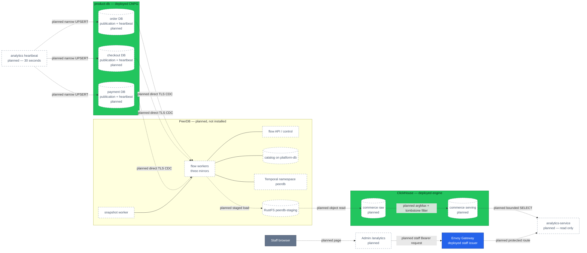
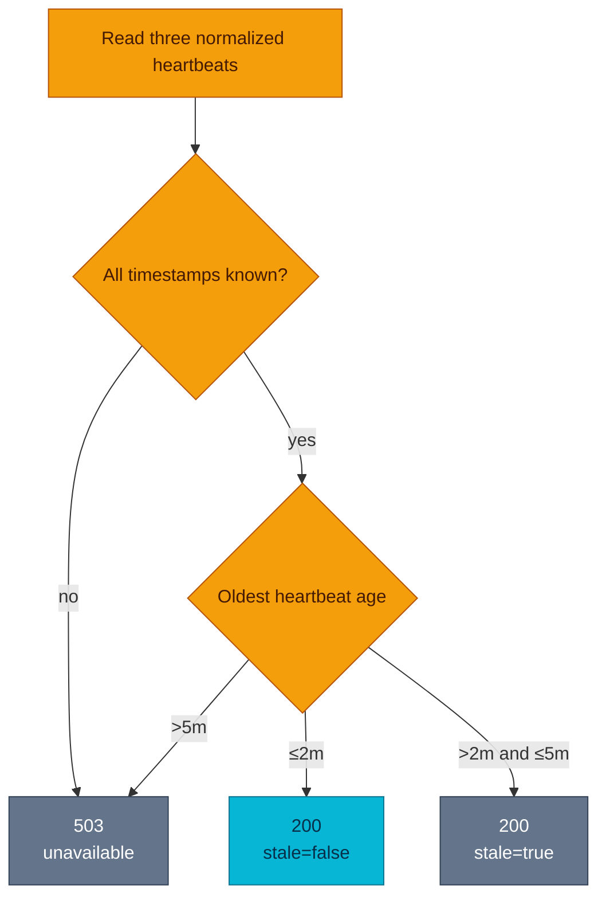

# RFC-0030 Backoffice commerce analytics on ClickHouse

| Status | Scope | Research | Created | Last updated |
|--------|-------|----------|---------|--------------|
| provisional | platform-wide | [./research.md](./research.md) — PeerDB direction audited 2026-09-08 | 2026-09-07 | 2026-09-08 |

> **Architecture proposal only.** PeerDB, the commerce schema, the analytics
> workloads, and the Admin route are planned and not deployed. PostgreSQL stays
> authoritative; ClickHouse is a rebuildable, bounded-eventual read model.

## Prerequisites

- [x] Research gate passed and the owner approved **ready for RFC**.
- [x] The owner replaced the earlier batch-first direction with PeerDB-first
      CDC before acceptance; this RFC and its research were rewritten together.
- [x] Context7 findings were cross-checked against versioned official sources.
- [x] Current source migrations and platform manifests were audited.
- [ ] A prototype must close the release/chart, freshness, column-publication,
      schema-evolution, and CNPG failover gates before this RFC can be Accepted.
- [x] No ADR number is reserved and no component is installed by this change.

## Summary

Self-host PeerDB to continuously replicate an explicit PostgreSQL base-table
and column allowlist from the `order`, `checkout`, and `payment` databases
into an isolated ClickHouse `commerce` database. Three database-local mirrors
feed versioned raw tables; serving views deduplicate with `argMax` and remove
tombstones. A thin read-only `analytics-service` exposes one staff endpoint,
and the Admin Portal consumes it from a lazy `/analytics` page.

The freshness objective is **two minutes end to end**, not a two-minute batch
schedule. A 30-second heartbeat row in each source database proves the complete
source → WAL → PeerDB → staging → ClickHouse path even when business traffic is
idle. A small reconciliation command checks correctness; it is not a second
ingestion engine.

## Motivation

The Backoffice answers live operational questions but cannot safely answer
historical questions about settled capture, refunds, checkout conversion, and
top products. Browser fan-out cannot establish one honest cross-domain
watermark, and repeated 90-day scans would couple review traffic to OLTP.

The platform already runs PostgreSQL 18 on CloudNativePG, ClickHouse 26.7,
Temporal, and RustFS. PeerDB is a narrower fit than building and operating a
custom extractor because it owns the PostgreSQL snapshot/WAL/checkpoint path.
It does not replace the semantic API, authorization, reconciliation, or
operational ownership described here. Detailed evidence and limitations are in
[research](./research.md).

### Goals

- Continuously ingest the seven selected base tables with target-observed
  freshness at or below two minutes.
- Serve one staff-only overview for settled money, funnel, trend, and top
  product aggregates over 7, 30, or 90 days.
- Keep analytics failures and ClickHouse outside every transactional request
  path.
- Preserve payment-ledger authority, checkout cohorts, historical order-item
  values, UTC boundaries, and per-currency isolation.
- Make per-source lag, stale data, unknown progress, and unavailability
  explicit to the API consumer and on-call.
- Keep source, heartbeat-write, PeerDB control, ClickHouse ingest, and
  ClickHouse read privileges separate.
- Prove snapshots, updates, deletes, failover, replay, and PII exclusion before
  acceptance.

### Non-goals

- General BI, ad hoc SQL, arbitrary dimensions, or database credentials in the
  browser.
- Revenue recognition, FX conversion, customer cohorts, or item allocation of
  refunds, tax, discount, and shipping.
- A global transaction or common LSN across three PostgreSQL databases.
- Replacing service APIs or moving transactional authority to ClickHouse.
- Kafka/Redpanda, Debezium, a custom `pgoutput` consumer, or a parallel batch
  ingestion pipeline.
- Installing `pg_cron`, `pg_duckdb`, `pg_mooncake`, TimescaleDB, Citus, or
  a columnar PostgreSQL extension in v1.
- Promising transparent schema evolution or zero-resnapshot CNPG failover
  before the prototype proves those properties.
- Replacing the operational Home dashboard.

## Proposal

1. Declare one CNPG `Publication` resource with explicit table/column objects
   and reclaim policy `retain` for each source database. Grant a dedicated
   PeerDB login `LOGIN`, `REPLICATION`, and `SELECT` only on the selected
   tables. Connect over TLS to `product-db-rw`, never PgDog or a read-only
   Service.
2. Run three PeerDB mirrors—one per database, publication, and slot. Reuse
   existing Temporal through a dedicated `peerdb` namespace, RustFS through a
   dedicated `peerdb-staging` bucket/identity, and `platform-db` through a
   dedicated PeerDB catalog database/role.
3. Update one technical heartbeat row per source every 30 seconds using the
   PostgreSQL server clock. Measure freshness only when that timestamp is
   visible in ClickHouse after normalization.
4. Write versioned raw rows with `_peerdb_version`, `_peerdb_is_deleted`, and
   sync metadata. Serving views select the latest version with `argMax`, then
   discard tombstones.
5. Normalize the inconsistent source `order_id` types to `String` in the
   serving model without modifying transactional schemas.
6. Let `analytics-service` query only serving objects, enforce the staff issuer
   plus `backoffice_admin`, and return one bounded overview.
7. Run nightly 7-day and weekly 90-day checksum reconciliation from a separate
   command/job. It detects or repairs bounded slices but never transports the
   primary change stream.

### User stories

- As operations staff, I can distinguish current data, bounded staleness, and
  an unavailable pipeline from a genuine zero.
- As product staff, I can compare settled capture, refunds, conversion, and top
  products for one currency and bounded interval.
- As finance-aware staff, I see ledger-derived money rather than amounts
  inferred from order state.
- As on-call, I can identify the lagging source and stop the consumer without
  affecting checkout or payment processing.
- As a source owner, I can review the exact tables and columns leaving my
  database.

## Decision outcome

**Chosen option:** undecided — architecture review pending

**Provisional recommendation:** self-hosted PeerDB PostgreSQL → ClickHouse CDC,
an isolated commerce model, and a thin read-only `analytics-service`.

This replaces the earlier 15-minute batch proposal before acceptance. PeerDB
removes a bespoke snapshot/checkpoint/retry transport and provides continuous
update/delete capture. The cost is a real control plane, logical slots and WAL
risk, broad-read credentials on selected tables, full initial snapshots, and
several upstream behaviors that the acceptance prototype must verify.

## Architecture

This diagram answers one question: **what is the planned trust and data path?**
Solid green stores and the blue gateway exist today. Every PeerDB, commerce,
analytics, and heartbeat object is planned and not installed.



**Legend** — grey: human client · blue: deployed edge · green: deployed data
boundary · dashed border/dotted edge: planned, not installed.

### Bounded-eventual response states

Each source heartbeat is independent. `data_through` is the oldest timestamp
actually observed in ClickHouse, not a global transaction boundary.



| Condition | HTTP | Contract |
|-----------|------|----------|
| Every source lag ≤2m | `200` | `stale=false`; return per-source lag |
| Any source lag >2m and ≤5m | `200` | `stale=true`; keep bounded last-known result |
| Any source lag >5m, state unknown, or freshness query unavailable | `503` | Do not present analytics as current |

PeerDB `RUNNING`, a small slot, the newest business row, and CDC batch end time
are not accepted freshness authorities. Idle sources require the heartbeat.

## Source contract

The business allowlist is fixed for v1. Publications and PeerDB mappings must
name every allowed column; a schema addition is excluded until reviewed.

| Database | Table | Allowed columns |
|----------|-------|-----------------|
| `order` | `orders` | `id`, `status`, `version`, `created_at`, `updated_at`, `completed_at` |
| `order` | `order_items` | `id`, `order_id`, `product_id`, `product_name`, `quantity`, `price`, `subtotal`, `created_at` |
| `checkout` | `checkout_sessions` | `id`, `status`, `order_id`, `currency`, `created_at`, `updated_at` |
| `payment` | `payments` | `id`, `order_id`, `currency`, `created_at`, `updated_at` |
| `payment` | `ledger_transactions` | `id`, `payment_id`, `kind`, `created_at` |
| `payment` | `ledger_entries` | `id`, `transaction_id`, `account_id`, `direction`, `amount_minor` |
| `payment` | `ledger_accounts` | `id`, `name`, `type` |

Each database also owns `analytics_cdc_heartbeat(id, emitted_at)`, with one
fixed primary-key row updated with `clock_timestamp()`. Replica-identity columns
are mandatory in every
publication column list. All selected tables currently have primary keys; the
ledger tables are append-only by trigger.

Forbidden data includes `user_id`, address JSON, shipping method, promo data,
payment method/token, provider identifiers, `external_ref`, decline/reason
text, idempotency material, workflow IDs, and audit actor/note data.

The PeerDB replication credential receives table-level `SELECT` on these
selected base tables because the initial snapshot requires it. That means it
can query forbidden columns in PostgreSQL even though publication columns and
PeerDB exclusions prevent those columns from reaching ClickHouse. This is an
explicitly accepted security drawback, bounded by exact-table grants, HBA,
NetworkPolicy, Secret isolation, audit, and no `BYPASSRLS`. It must never gain
`SELECT ON ALL TABLES IN SCHEMA`.

## Data model and metric semantics

- Payment ledger transactions and their `merchant_revenue` leg own capture,
  reversal, refund, and net-captured values.
- Checkout sessions own cohort membership and checkout/order conversion.
- Orders own completion state; order items preserve point-in-time product
  name, quantity, price, and subtotal.
- Money remains integer minor units and is never summed across currencies.
- `from` is inclusive, `to` exclusive, and every boundary is UTC.
- Raw tables retain `_peerdb_version`, `_peerdb_is_deleted`, and a sync
  timestamp. Serving views take the latest version, then filter deleted rows.
- Source `order_id` values (`integer`, `text`, and `bigint`) normalize to
  `String` only in ClickHouse serving objects.
- API history is capped at 90 days. Physical raw retention and full-snapshot
  capacity are set only after measurement; PeerDB cannot pretend its initial
  snapshot was filtered to 90 days.

## API and Admin Portal

The only planned read operation is:

```text
GET /analytics/v1/protected/commerce/overview?currency=USD&from=YYYY-MM-DD&to=YYYY-MM-DD
```

It returns the existing overview dimensions plus:

```json
{
  "meta": {
    "generated_at": "2026-09-07T10:00:30Z",
    "data_through": "2026-09-07T10:00:00Z",
    "stale": false,
    "sources": [
      {
        "name": "order",
        "synced_at": "2026-09-07T10:00:00Z",
        "lag_seconds": 30,
        "state": "healthy"
      }
    ]
  }
}
```

`sources` contains exactly `order`, `checkout`, and `payment`; state is
`healthy`, `stale`, or `unavailable`. The service rejects unbounded
intervals, arbitrary SQL/columns, non-staff issuers, and callers without
`backoffice_admin`. Exact payload ownership moves to `docs/api/` only after
implementation.

The Admin Portal adds a lazy `/_authenticated/analytics` route and leaves Home
unchanged. It uses the existing TanStack/shadcn/Tailwind patterns, one query,
visible UTC/freshness labels, and accessible table equivalents for charts.

## Security considerations

- CNPG `Publication` resources reconcile the three publications as GitOps;
  source migrations create the heartbeat objects and exact ACLs. PeerDB does
  not receive DDL or ownership.
- Use one non-owning PeerDB login per database and one narrow heartbeat writer
  per database. CNPG `DatabaseRole` manages login/password lifecycle, not
  publications or table ACLs.
- Connect PeerDB directly to `product-db-rw.product.svc:5432` using TLS.
  Logical decoding cannot use PgDog or `product-db-ro`.
- Separate PeerDB control, catalog, staging, ClickHouse ingest, ClickHouse read,
  and heartbeat credentials. OpenBAO/ESO delivers every Secret.
- Keep PeerDB UI and administrative APIs cluster-internal. The public API gets
  no source, staging, catalog, Temporal, or ClickHouse-write credentials.
- NetworkPolicy allows only the exact workload-to-service paths. New workloads
  require resources, probes, and the repository's Kyverno baseline.
- Inspect ClickHouse raw columns and staged objects for forbidden data before
  enabling any API route.
- PeerDB core is AGPL-3.0; the official enterprise chart repository uses ELv2.
  License and chart use require an explicit pre-acceptance review.

## Observability and SLO

The transactional services gain no analytics dependency or shared error
budget. Before exposure, instrument and dashboard:

- target-observed heartbeat lag for each source;
- PostgreSQL, PeerDB, ClickHouse, and API host clock skew;
- slot active state, retained WAL bytes/time, invalidation, and restart LSN;
- snapshot/catch-up progress, rows, commit lag, retries, and errors per mirror;
- PeerDB worker, flow API, catalog, Temporal namespace, and staging health;
- staging object age/cleanup and RustFS/ClickHouse reachability;
- raw/serving row counts, tombstones, schema drift, and reconciliation deltas;
- ClickHouse query duration/memory/errors; and
- analytics API request duration, errors, and response freshness state.

Alert at two minutes (warning) and five minutes or unknown (critical). The
runbook must distinguish a stopped heartbeat writer, a lagging logical slot, a
stalled PeerDB flow, staging failure, ClickHouse normalization lag, and a
freshness query failure.

## Rollout and rollback

Roll out in dependency order, with each phase blocked on its evidence:

1. **Prototype:** pin PeerDB core and chart/image digests; review AGPL/ELv2;
   prove the chart/image combination, resource floor, and external dependency
   configuration.
2. **Source safety:** size `max_replication_slots`, `max_wal_senders`,
   `max_slot_wal_keep_size`, connections, and WAL storage. Create roles, exact
   HBA/TLS/NetworkPolicy, heartbeat tables, CNPG column-list `Publication`
   resources with reclaim `retain`, and mirror exclusions. Require
   `status.applied=true` at the observed generation before creating a mirror.
3. **Isolated dependencies:** create the `peerdb` Temporal namespace,
   `peerdb-staging` RustFS bucket/identity, and dedicated PeerDB catalog
   database/role in `platform-db`.
4. **Analytical storage:** create least-privilege ClickHouse identities and
   replicated raw/serving objects through a dedicated schema wave.
5. **Mirrors:** start and validate order, then checkout, then payment. Observe
   full snapshot source/WAL/ClickHouse load and catch-up before adding the next.
6. **Correctness gate:** prove insert/update/delete/tombstone behavior, column
   exclusion, 30-second heartbeats, ≤2-minute freshness, reconciliation,
   schema-change recovery, CNPG switchover/failover, and WAL-cap resync.
7. **Dark launch:** deploy the read API without gateway or Admin navigation;
   run metric, authorization, failure, and performance tests.
8. **Consumer:** add the protected route, then the Admin page only after the
   previous gates pass.
9. **Close-out:** run the full release audit; update `docs/api/`, platform docs,
   runbooks, ADR Adoption, RFC history, and CHANGELOG.

Rollback removes Admin navigation and gateway reachability first, then stops
the API and pauses mirrors. Keep raw data and logical slots while deciding
resume versus resync. Dropping a mirror can drop its slot; never remove a slot
until retained-WAL impact and recovery intent are explicit. Cleanup of source
publications, heartbeat objects, catalog, and staging is a later reviewed step.
No rollback writes transactional business data.

## Testing and acceptance

- Snapshot under concurrent writes; then verify insert, update, delete,
  tombstone, duplicate delivery, PeerDB restart, and large transaction behavior.
- Inspect publication, PeerDB mapping, staging files, raw tables, serving views,
  logs, and traces to prove forbidden columns never leave PostgreSQL.
- Stop each of ClickHouse, RustFS, PeerDB worker/API/catalog, Temporal, and each
  network path; verify recovery and bounded WAL.
- Rotate every credential and prove least privilege with positive and negative
  connection tests.
- Exercise CNPG switchover and unplanned failover. Acceptance requires no gap,
  or an explicit resync/runbook decision if PeerDB slots cannot resume safely.
- Exercise additive, dropped, and type-changing source columns. Do not claim
  automatic ClickHouse schema evolution unless the pinned version proves it.
- In idle and busy traffic, verify each target heartbeat remains ≤2 minutes;
  verify `200 stale=true` through five minutes and `503` beyond five minutes
  or when the authority is unavailable.
- Reconcile nightly 7-day and weekly 90-day source/target checksums.
- Load at least one million representative facts and prove correct 7/30/90-day
  output, `argMax` query p95 ≤500 ms, peak query memory ≤512 MiB, and no
  ClickHouse pod restart.
- Test API validation/auth/errors and Admin loading, empty, stale, unavailable,
  keyboard, reduced-motion, and responsive states.
- Run `make validate`, compose/Kind k6 gates, and the complete local-stack A/B/C
  audit before tagging any affected service or frontend release.

The RFC cannot become Accepted until the prototype additionally proves:

1. a compatible released chart/image combination;
2. PostgreSQL publication column lists plus PeerDB exclusions across snapshot
   and CDC;
3. a target-observed heartbeat rather than status-derived freshness;
4. exact schema-evolution recovery on the pinned build; and
5. CNPG logical-slot behavior through switchover and failover.

## Alternatives

| Option | Why not selected for v1 |
|--------|-------------------------|
| Custom 15-minute batch sync | Simpler infrastructure, but makes the team own snapshot boundaries, watermarks, overlap, retry, delete capture, and a second transport implementation; retained only as fallback if the PeerDB prototype fails |
| Service export APIs | Adds three bulk contracts and repeated serialization/application load for a warehouse-shaped path |
| Direct PostgreSQL analytics or materialized views | Keeps interactive OLAP and cross-database orchestration on transactional infrastructure |
| `pg_duckdb`, `pg_mooncake`, TimescaleDB, Citus/columnar extensions | Adds operand packaging/preload/upgrade/DR duties and does not remove the three-database semantic boundary |
| `pg_cron` heartbeat | Official PeerDB guidance shows a short-period heartbeat, but the extension is not in the deployed CNPG inventory; adding an extension only for freshness is more invasive than a narrow existing-service command |
| Debezium plus Kafka/Redpanda | Strong general event backbone, but broker, Connect, topics, schemas, replay, and ordering exceed one analytical consumer |
| ClickHouse `MaterializedPostgreSQL` | Experimental/maturity and DDL constraints do not meet the default production bar |
| Custom `pgoutput` consumer | Permanently transfers snapshot, checkpoint, type mapping, retry, DDL, and support ownership to the platform |
| Browser/Grafana direct to ClickHouse | Violates the consumer trust boundary and does not provide the product/API semantics |

## Resulting decisions

Architecture review must split these choices into one ADR each. No number is
reserved while the RFC is provisional.

| Decision | ADR | Status |
|----------|-----|--------|
| Adopt self-hosted PeerDB PostgreSQL → ClickHouse CDC with isolated reuse of Temporal, RustFS, and `platform-db` | TBD at architecture review | Not created |
| Manage allowlisted base-table columns through CNPG `Publication` resources and accept table-wide source `SELECT` for the replication credential | TBD at architecture review | Not created |
| Add a thin read-only `analytics-service` as the ADR-048 aggregation escape hatch | TBD at architecture review | Not created |

Expected contract updates after implementation are `docs/api/analytics.md`, the
service rollup in `docs/api/README.md`, the Admin consumer index
`docs/api/admin.md`, the cross-service topology in `docs/api/api.md`, and the
relevant feature ownership in `docs/api/microservices.md`.

## Implementation history

- 2026-09-08 — RFC rewritten around PeerDB before acceptance; no implementation
  or ADR created.
- 2026-09-07 — Earlier batch-first RFC published as `provisional`.

## Related

- [Research and Context7 audit](./research.md)
- [RFC-0019 — observability architecture and original optional facts sketch](../RFC-0019/)
- [RFC-0023 — Backoffice portal](../RFC-0023/)
- [RFC-0028 — ClickHouse replicated topology](../RFC-0028/)
- [ADR-048 — Admin Portal has no BFF by default](../../adr/ADR-048-admin-portal-no-bff/)
- [Admin consumer contract](../../../api/admin.md)
- [PostgreSQL extension policy and inventory](../../../databases/extensions.md)
- [ClickHouse platform guide](../../../observability/clickhouse/README.md)

---
_Last updated: 2026-09-08_
