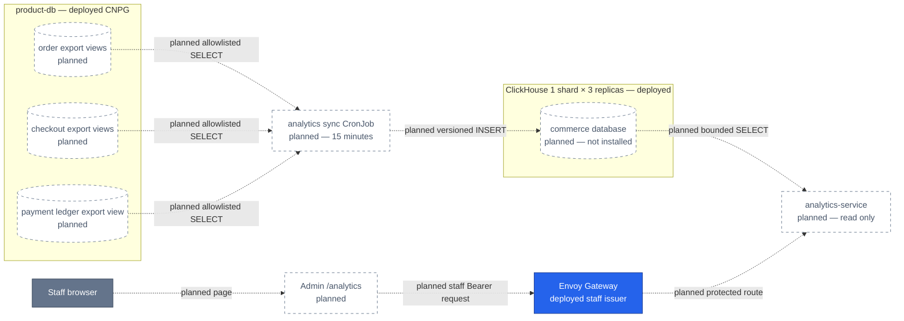

# RFC-0030 Backoffice commerce analytics on ClickHouse

| Status | Scope | Research | Created | Last updated |
|--------|-------|----------|---------|--------------|
| provisional | platform-wide | [./research.md](./research.md) — gate passed 2026-09-07 | 2026-09-07 | 2026-09-07 |

> **Research and architecture review only.** The target components in this RFC
> are planned and not deployed. PostgreSQL remains the transactional authority;
> this proposal creates a rebuildable analytical read model.

## Prerequisites

- [x] [`research.md`](./research.md) foundation merged in #1000, #1020, and
      #1021; its [research review gate](./research.md#research-review-gate)
      passed 2026-09-07 and the final audit ships with this RFC PR
- [x] Context7 audit complete; version-bound claims cross-checked against
      official product documentation
- [x] Owner approved **ready for RFC** on 2026-09-07
- [x] Mechanism details remain in research and are linked rather than repeated
- [x] Expected ADR subjects and `docs/api/` touchpoints are listed below; no ADR
      number is reserved before architecture review

## Summary

Add a read-only `analytics-service`, a 15-minute batch sync, an isolated
ClickHouse `commerce` database, and a dedicated Admin Portal `/analytics` page.
The sync reads narrow service-owned views from the `order`, `checkout`, and
`payment` PostgreSQL databases and publishes only completed cross-source batches.
The API serves bounded 7-, 30-, or 90-day aggregates to authorized staff. CDC,
customer drill-down, and PostgreSQL analytical extensions remain deferred.

## Motivation

The Backoffice answers current operational questions but cannot safely answer
historical questions such as settled capture, refunds, checkout conversion, or
top products. Browser fan-out cannot establish one cross-domain cut-off, and
interactive 90-day queries would couple product review traffic to transactional
PostgreSQL. The platform already operates replicated ClickHouse, so the smallest
useful next step is a governed analytical copy rather than another datastore.

The metric definitions, worked examples, source evidence, and Context7 audit
are in [research](./research.md).

### Goals

- Serve one staff-only commerce overview with settled-money, funnel, trend, and
  top-product aggregates.
- Keep analytical scans and ClickHouse failure outside every transactional
  request path.
- Publish a new result only when all three source extracts complete.
- Preserve payment-ledger authority, checkout cohort semantics, historical
  order-item values, UTC boundaries, and currency isolation.
- Expose no more than 90 days while retaining 100 physical days for repair and
  TTL headroom.
- Make stale, failed, and unavailable states visible to users and operators.
- Use separate source-read, ClickHouse-ingest, and ClickHouse-read identities.
- Fit the existing Admin Portal stack and visual system.

### Non-Goals

- General-purpose BI, ad hoc SQL, chart builders, or browser access to a
  database.
- Revenue recognition, exchange-rate conversion, customer cohorts, or
  item-level allocation of refunds, tax, discounts, and shipping.
- Transactional commands or fallback writes to PostgreSQL.
- CDC, PeerDB, Debezium, Kafka, or a custom logical-decoding consumer in v1.
- Installing a PostgreSQL analytical extension or changing the CNPG operand
  image.
- Hard-delete discovery; a new source delete path must reopen transport
  correctness before deployment.
- Replacing the operational Home dashboard.

## Proposal

Introduce one analytical vertical slice:

1. Each source service owns an `analytics_export` schema containing explicit,
   versioned, PII-minimised views.
2. A CNPG-managed non-owning reader connects directly to `product-db-ro` and
   receives only `CONNECT`, schema `USAGE`, and named-view `SELECT` grants.
3. A scheduled sync runs every 15 minutes with a one-hour overlap and writes
   versioned facts plus a `sync_runs` publication record to ClickHouse.
4. ClickHouse stores commerce data separately from `otel`; serving queries use
   `argMax` and completed-batch filtering rather than relying on background
   merges or request-path `FINAL`.
5. `analytics-service` validates the staff issuer and `backoffice_admin` role,
   queries ClickHouse with a read-only identity, and exposes one bounded
   overview endpoint.
6. The Admin Portal adds a lazy `/analytics` route using its existing TanStack,
   shadcn, and Tailwind patterns plus Recharts for the trend and funnel.

The API server and sync command may share a repository and image, but run as
different Kubernetes workloads with different Secrets and network access.

### User Stories

- As operations staff, I can see when the analytical data was last complete and
  distinguish stale data from a genuine zero.
- As product staff, I can compare settled capture, refunds, conversion, and top
  products for one currency over a bounded interval.
- As finance-aware staff, I see payment-ledger amounts rather than totals inferred
  from order state.
- As on-call, I can stop ingestion or remove the route without affecting order,
  checkout, or payment processing.
- As a source-service owner, I can review exactly which columns and semantics
  leave my database.

### Alternatives

- **Transport:** choose a 15-minute batch now; reopen CDC only after a measured
  freshness, scale, hard-delete, or OLTP-impact trigger.
- **Serving boundary:** choose a dedicated read-only `analytics-service`; do not
  turn the browser into an aggregator or expose ClickHouse credentials.
- **Source contract:** choose service-owned export views; do not grant broad
  table access or make an external loader interpret private accounting tables.
- **Deduplication:** use `argMax` for the serving path and reserve `FINAL` for
  verification and diagnosis.
- **Visualization:** add Recharts only to the lazy analytics route; keep a
  text/table equivalent and a 10 KiB gzip initial-shell growth limit.

## Other solutions considered

The full comparison, including the PostgreSQL extension matrix, is in
[research § Alternatives](./research.md#alternatives).

| Option | Shape | Why not chosen |
|--------|-------|----------------|
| Existing APIs plus browser aggregation | Admin Portal calls owning services and joins results | No historical contracts or common completed cut-off; duplicates semantics in the browser |
| New bulk APIs on all three owners | Server pulls paginated exports through service runtimes | Three new bulk contracts and repeated serialization/application load for a warehouse-shaped job |
| Direct PostgreSQL analytics | Query service scans OLTP or a central FDW/materialized-view database | Keeps storage, refresh, and interactive OLAP pressure in PostgreSQL and still crosses three databases |
| PostgreSQL analytical extensions | `pg_duckdb`, `pg_mooncake`, TimescaleDB, or columnar/Citus family | Native artifacts, preload/restart and DR obligations; does not remove the cross-database semantic boundary |
| Grafana or browser to ClickHouse | Existing dashboard/client talks directly to analytical storage | Wrong product UX and trust boundary; exposes a database query surface to consumers |
| Self-hosted PeerDB CDC | Three PostgreSQL mirrors snapshot and stream into ClickHouse | Adds slots, retained WAL, workers, catalog, Temporal, staging storage and schema-evolution operations before sub-five-minute freshness is required |
| Debezium plus Kafka/Redpanda | General change-event backbone and ClickHouse sink | Broker, Connect, topics, schemas, replay and ordering are disproportionate for one analytical consumer |
| ClickHouse `MaterializedPostgreSQL` | ClickHouse directly replicates PostgreSQL tables | Experimental/maturity and DDL constraints are unsuitable for the default production path |
| Custom `pgoutput` consumer | Platform-owned snapshot and logical-decoding implementation | Makes the platform own checkpointing, type mapping, retries, DDL and support indefinitely |

## Decision outcome

**Chosen option:** undecided — architecture review pending

**Rationale:** The provisional recommendation is **read-only
`analytics-service` + 15-minute batch + service-owned export views + ClickHouse
commerce read model**. It best satisfies isolation, auditable semantics, bounded
freshness, and rollback with components already present in the platform. The
runner-up is self-hosted PeerDB CDC; batch wins provisionally because no current
freshness, hard-delete, or scale evidence justifies PeerDB's WAL and control-plane
surface.

## Architecture & Diagrams

This diagram answers one question: **what is the proposed target trust and data
path?** Solid data stores and the gateway exist today. Every analytical object,
workload, route, and edge is planned and not installed.



**Legend** — grey: human client · blue: deployed edge · dashed border and dotted
edge: planned, not installed. The deployed CNPG and ClickHouse boundaries do not
make their planned schemas or workloads current state.

## Design Details

### Metric and source contract

- Payment ledger postings are authoritative for settled capture, reversals,
  refunds, net captured amount, and captured-order identity.
- Checkout sessions own cohort membership and checkout/order conversion.
- Orders own completion state; order items own historical product name, quantity,
  price, and subtotal.
- Amounts remain integer minor units and are never summed across currencies.
- `from` is inclusive, `to` is exclusive, and all boundaries are UTC.
- Forbidden export fields include user identity, address, payment method/token,
  provider references, idempotency keys, workflow IDs, and free-form reasons.

### Ingestion and publication

- Initial load covers the 90-day product window.
- The regular batch runs every 15 minutes with `concurrencyPolicy: Forbid`, a
  one-hour overlap, and a ten-minute deadline.
- ClickHouse inserts contain at least 1,000 rows where available and target
  10,000–100,000 rows.
- A monotonically increasing `batch_seq` identifies every attempt. Only a
  `sync_runs` row marked `complete` makes that attempt visible.
- Independent source transactions record independent cut-offs. API
  `data_through` is their minimum, never a claimed distributed snapshot.
- Nightly repair re-reads seven days. Weekly reconciliation checks the full
  90-day window and repairs only mismatched day/currency slices.
- The API exposes 90 days; ClickHouse retains 100 physical days. TTL cleanup may
  lag because it occurs during merges.
- V1 has no hard-delete discovery. A source delete path is a breaking analytical
  contract until it supplies tombstones, slice replacement, or an accepted CDC
  decision.

### Read API

The planned edge operation is:

```text
GET /analytics/v1/protected/commerce/overview?currency=USD&from=YYYY-MM-DD&to=YYYY-MM-DD
```

It returns one bounded response containing metadata, available currencies,
money/order KPIs, daily trend, checkout funnel, and top products. Validation
allows at most 90 days and one ISO 4217 currency. The response includes
`generated_at`, `data_through`, and `stale`. It returns the shared error envelope
for invalid input or authorization failure, and `503` when no completed batch or
ClickHouse result is available. Exact payload ownership moves to `docs/api/`
only when implementation is complete.

### Admin Portal

- Add `/_authenticated/analytics` and one `Analytics` navigation item; leave Home
  unchanged.
- Keep currency and 7/30/90-day range in validated URL search state.
- Use one TanStack Query request and consume its `AbortSignal`.
- Lazy-load Recharts 3.10.1 with matching React 19.2.8 `react-is`; cap initial
  shell growth at 10 KiB gzip.
- Present a wide trend, funnel, and ranked product table in existing portal
  tokens. Mobile stacks them in reading order.
- Provide keyboard access, non-hover values, reduced motion, text/table chart
  equivalents, visible UTC labels, and distinct empty/stale/unavailable states.

### Enable, disable, and drawbacks

Nothing changes by default until its rollout phase is enabled. Source views and
ClickHouse tables are inert without the CronJob; the API is unreachable until
its gateway route exists; the page is undiscoverable until navigation ships.
Disable the feature by suspending sync, removing the route and navigation, and
leaving isolated ClickHouse data for investigation.

Costs accepted by this proposal are a new service repository/runtime, one
CronJob, cross-repository source migrations, three classes of credentials,
ClickHouse storage, alerts/runbooks, and eventual consistency. A completed
batch is not a global source transaction, and replica reads may lag. The design
exposes that limitation through independent cut-offs and the minimum
`data_through` watermark.

## Security considerations

- CNPG `DatabaseRole` manages the non-owning PostgreSQL login and password
  lifecycle. Service migrations own exact object grants; the CR does not manage
  schema/table/view privileges or continuously repair manual SQL drift.
- Sync reads `product-db-ro` directly over TLS, never through PgDog. HBA and
  NetworkPolicy allow only the three named databases and planned sync workload.
- ClickHouse uses separate `commerce_schema`, `commerce_ingest`, and
  `commerce_read` identities. Exact object grants are SQL-managed; no workload
  inherits the shared `default` account.
- OpenBAO and External Secrets deliver credentials. No Secret value is committed
  to Git, logged, traced, returned by the API, or delivered to the browser.
- The sync workload gets PostgreSQL read and ClickHouse ingest credentials but
  no staff JWT configuration. The API gets ClickHouse read credentials but no
  PostgreSQL or ClickHouse write credential.
- Envoy and the service both validate the staff issuer; the service requires
  `backoffice_admin`. Callers cannot submit SQL, columns, sort expressions, or
  unbounded ranges.
- New workloads must satisfy Kyverno resources/probes/PSS and receive explicit
  namespace-scoped NetworkPolicies.

## Observability & SLO impact

The transactional services gain no dependency on analytics and consume no
analytics error budget. The Admin page has a separate eventual-consistency
contract:

- completed-batch age at or below 30 minutes is healthy;
- above 30 minutes is stale and warns while serving the last complete batch;
- above 60 minutes is critically stale and alerts while retaining last-good
  values; and
- no completed batch or unavailable ClickHouse returns `503` and never falls
  through to PostgreSQL.

Emit sync duration/outcome, rows per source, source-watermark lag,
completed-batch age, reconciliation differences, API request duration/errors,
and ClickHouse query duration/errors. Trace extraction, insert, publication, and
query stages without SQL values or business identifiers. Add warning/critical
freshness alerts, sync/reconciliation failure alerts, a dashboard, and a runbook
before exposing navigation.

## Rollout & rollback

Roll out in dependency order with one owner and acceptance gate per phase:

1. **Decision:** review this RFC; create the two decision-shaped ADRs below at
   `Proposed`. Acceptance moves RFC and ADRs together.
2. **Source contract:** create the retained CNPG reader/Secret/HBA first, then
   ship versioned export-view migrations and exact grants in the three service
   repositories.
3. **Analytical storage:** create SQL-managed ClickHouse identities and the
   isolated replicated `commerce` objects through a dedicated GitOps schema
   wave; verify rotation and privileges.
4. **Sync dark launch:** deploy the CronJob without an external route. Complete
   initial load, nightly repair, weekly reconciliation, failure drills, and the
   one-million-fact benchmark.
5. **API dark launch:** deploy `analytics-service` and NetworkPolicy; validate
   the protected route internally while Admin navigation remains absent.
6. **Consumer:** add gateway routing, then ship the lazy Admin page and
   navigation only after freshness and query gates pass.
7. **Close-out:** run the full release audit, update `docs/api/`, platform docs,
   runbooks, ADR Adoption, RFC history, and CHANGELOG.

Rollback removes navigation and gateway reachability first, then suspends the
CronJob. Keep the previous complete batch and isolated tables for diagnosis.
No rollback step mutates or restores transactional PostgreSQL data. Source
views and grants can be removed later in a separately reviewed backward rollout.

## Testing / verification

- Unit-test metric semantics with capture, reversal, refund, currency, cohort,
  late-update, duplicate-version, and zero-denominator cases.
- Integration-test export allowlists, read-only privileges, HBA/TLS,
  ClickHouse grants, completed-batch visibility, overlap retry, TTL, and
  reconciliation against PostgreSQL checksums.
- Load one million representative facts and prove correct 7/30/90-day results,
  `argMax` query p95 at or below 500 ms, peak query memory at or below 512 MiB,
  no ClickHouse pod restart, and no visibility of incomplete batches.
- Drill one source failure, ClickHouse insert/outage, overlapping schedule,
  duplicate version, stale/no-data state, Secret rotation, and rollback.
- Test API validation, staff issuer/role enforcement, shared errors, and the
  absence of arbitrary query input.
- Run Admin unit/accessibility tests and Playwright at 320, 768, 1024, and
  1440 px; measure the initial bundle and verify loading/empty/stale/error states.
- Run `make validate`, the compose and Kind k6 gates, and the complete local-stack
  A/B/C release audit before tagging any affected service or frontend release.

## Resulting decisions

Architecture review must split these independent choices into one ADR each. No
number is reserved in a provisional RFC.

| Decision | ADR | Status |
|----------|-----|--------|
| Build a batch-fed ClickHouse commerce read model from service-owned PostgreSQL export views | TBD at architecture review | Not created |
| Add a read-only `analytics-service` as the explicit ADR-048 aggregation escape hatch | TBD at architecture review | Not created |

Expected contract updates after implementation are `docs/api/analytics.md`, the
service rollup in `docs/api/README.md`, the Admin consumer index
`docs/api/admin.md`, the cross-service topology in `docs/api/api.md`, and the
relevant feature ownership in `docs/api/microservices.md`.

## Implementation History

- 2026-09-07 — RFC published as `provisional`; no implementation or ADR created.

## Related

- [Research and Context7 audit](./research.md)
- [RFC-0019 — observability architecture and original optional facts sketch](../RFC-0019/)
- [RFC-0023 — Backoffice portal](../RFC-0023/)
- [RFC-0028 — ClickHouse replicated topology](../RFC-0028/)
- [ADR-048 — Admin Portal has no BFF by default](../../adr/ADR-048-admin-portal-no-bff/)
- [Admin consumer contract](../../../api/admin.md)
- [PostgreSQL extension policy and inventory](../../../databases/extensions.md)
- [ClickHouse platform guide](../../../observability/clickhouse/README.md)

---
_Last updated: 2026-09-07_
