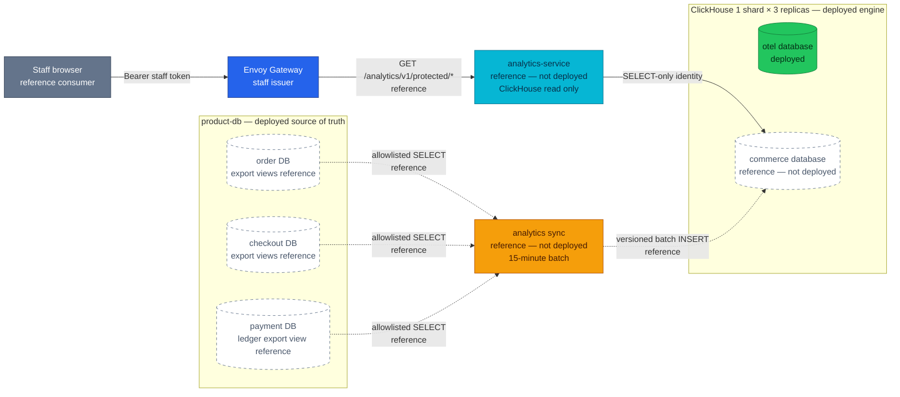
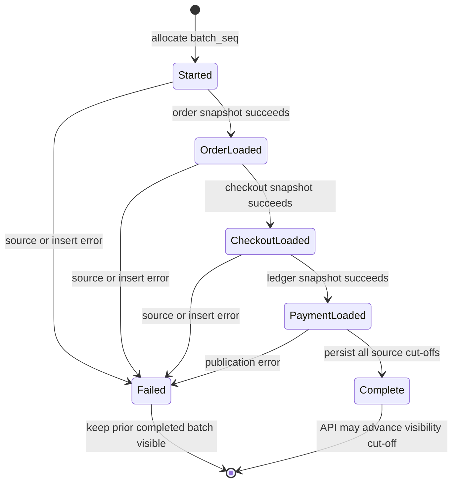
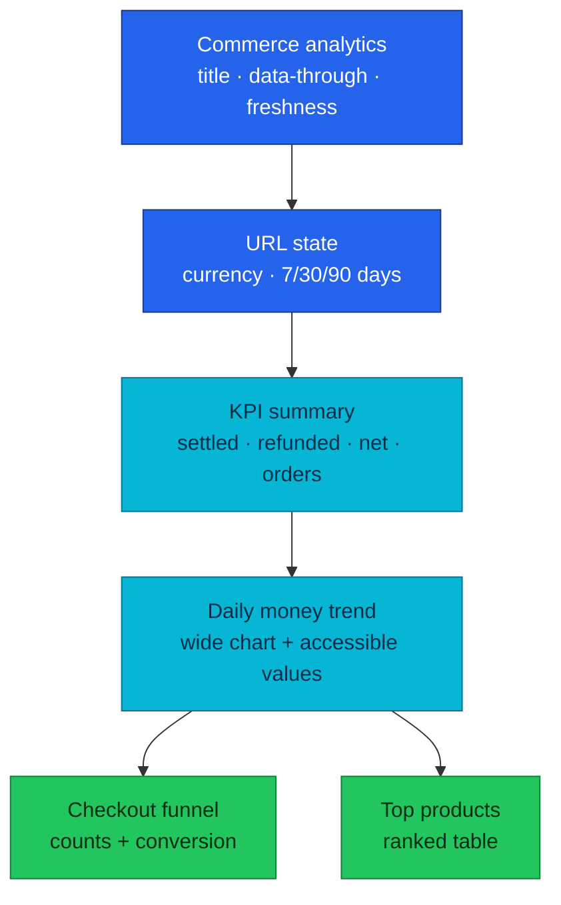
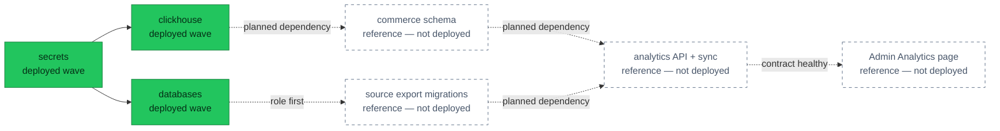
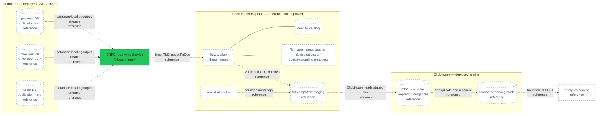
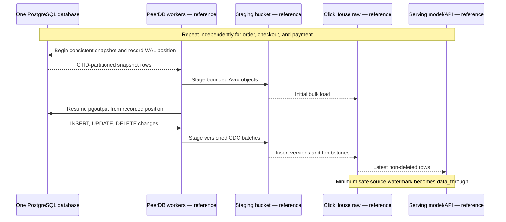

# RFC-0030 — Research: Backoffice commerce analytics on ClickHouse

| | |
|---|---|
| **RFC** | RFC-0030 |
| **Status** | researching → gate passed with README |
| **Scope** | platform-wide |
| **Created** | 2026-09-06 |
| **Last updated** | 2026-09-07 |

> **Research only.** Nothing in this document is deployed. Candidate components
> and paths are labelled **reference — not deployed** until an RFC is reviewed,
> accepted, implemented, and reflected in [`docs/api/`](../../../api/README.md).

---

## Table of contents

1. [Problem statement](#problem-statement)
2. [Reading path](#reading-path)
3. [What commerce analytics is](#what-commerce-analytics-is)
4. [Core components](#core-components)
5. [Core mechanism](#core-mechanism)
6. [Glossary](#glossary)
7. [Worked examples](#worked-examples)
8. [Metric semantics](#metric-semantics)
9. [Product and interaction design](#product-and-interaction-design)
10. [vs platform as-built](#vs-platform-as-built)
11. [Integration paths](#integration-paths)
12. [Deferred CDC adoption dossier](#deferred-cdc-adoption-dossier)
13. [Security and authorization](#security-and-authorization)
14. [Failure model and operations](#failure-model-and-operations)
15. [Alternatives](#alternatives)
16. [Remaining validation](#remaining-validation)
17. [FAQ](#faq)
18. [References](#references)
19. [Context7 audit log](#context7-audit-log)
20. [Research review gate](#research-review-gate)

---

## Problem statement

### Real-world trigger

| | |
|---|---|
| **Situation** | A product or operations review asks what converted, what money settled, and which products drove captured orders during the last 7–90 days. The Backoffice can answer live case questions, but it has no historical, cross-domain analytical read model. |
| **Who feels it** | Product and operations need repeatable numbers; finance needs money labels that follow the ledger; platform/on-call must keep analytical scans and failures away from the transactional path. |
| **Why now** | RFC-0023 is implemented, its operational dashboard is stable, and RFC-0019 already reserved commerce facts as an optional future ClickHouse use. ClickHouse now runs as a replicated 1×3 service, so the missing work is a governed data product rather than adopting another database. |
| **If we do nothing** | People either export three PostgreSQL databases by hand, infer revenue from `order.total`, build inconsistent Grafana queries, or add more browser fan-out. Each path produces numbers that are difficult to audit and can load OLTP at review time. |

> **In plain terms:** the portal can show which order is stuck, but it cannot
> safely answer how the business moved over time.

This is not a request for a generic BI warehouse. The concrete first consumer
is the staff Backoffice, and the concrete questions are deliberately bounded:

- daily settled capture, refunds, and net captured amount;
- checkout → order → payment → completion conversion;
- top products within captured orders; and
- whether the displayed data is fresh, stale, or unavailable.

### What homelab practice proves

- A read-only analytical copy can serve 90-day questions without making
  PostgreSQL an interactive OLAP engine.
- A batch can fail halfway without publishing a half-new/half-old dashboard.
- Payment-ledger semantics can remain the money authority while order and
  checkout provide product and funnel context.
- A staff API can expose the result without giving a browser ClickHouse or
  PostgreSQL credentials.
- The feature can fit the existing Admin Portal design system instead of
  introducing a second frontend architecture.

### Success criteria for the research

The research gate passes only when a reviewer can answer all of these without
inventing implementation policy:

1. Which system owns every number?
2. How does a partially failed batch stay invisible?
3. What does stale mean, and what does the operator see?
4. Which credentials exist at each boundary?
5. Why is a new read service justified despite ADR-048?
6. Why is 15-minute batch preferable to CDC for the first slice?
7. How does the page remain recognisably part of the current Backoffice?

---

## Reading path

1. Start with [Metric semantics](#metric-semantics). Storage is secondary to
   agreeing what the numbers mean.
2. Read [Core mechanism](#core-mechanism) for the candidate consistency model.
3. Compare it with reality in [vs platform as-built](#vs-platform-as-built).
4. Use [Alternatives](#alternatives) and
   [Remaining validation](#remaining-validation) for the evidence still needed
   before an RFC is authored.

---

## What commerce analytics is

Commerce analytics is a **derived read model**. It copies a narrow allowlist of
transactional facts, preserves their business identifiers and timestamps, and
organises them for repeated historical aggregation. It does not accept writes
to orders, payments, refunds, checkout sessions, or products.

> **In plain terms:** PostgreSQL keeps the receipts; ClickHouse keeps a
> query-friendly index of selected receipt facts.

Three properties distinguish this from putting a chart over a SQL query:

1. **Semantic ownership.** Payment ledger postings define settled money;
   checkout sessions define the funnel cohort; order items define historical
   product name, quantity, and item subtotal.
2. **Publication boundary.** A result becomes visible only after all required
   sources reach a common completed batch.
3. **Serving boundary.** A role-gated HTTP API returns bounded aggregates. The
   browser never submits arbitrary SQL and never receives database credentials.

The proposed 15-minute freshness is near-time, not real-time. That is a product
contract: every response must say how far through source history it represents.

---

## Core components

| Component | Role | Candidate state |
|-----------|------|-----------------|
| PostgreSQL export views | Service-owned, column-allowlisted read contracts in `order`, `checkout`, and `payment` | reference — not deployed |
| `analytics_reader` | CNPG-managed login allowed to read only those views | reference — not deployed |
| `analytics sync` | Bounded 15-minute extractor/loader; no business writes | reference — not deployed |
| `commerce` database | ClickHouse database isolated from the existing `otel` database | reference — not deployed |
| Versioned fact tables | Retain source versions and batch identity for retry-safe reads | reference — not deployed |
| `sync_runs` | Records source cut-offs and the publication state of each batch | reference — not deployed |
| `analytics-service` | Staff-authenticated, read-only semantic API over ClickHouse | reference — not deployed |
| Admin `/analytics` page | KPI, trend, funnel, and product views in the existing portal shell | reference — not deployed |

The API process and sync process may share one repository and image, but they
must be separate runtime identities. The API needs ClickHouse `SELECT`; the
sync workload needs PostgreSQL view `SELECT` and ClickHouse `INSERT`. Sharing a
binary must not become sharing authority.

---

## Core mechanism

### Target trust and data path

This diagram answers one question: **where does a commerce fact travel, and
which component may read it?** Every analytics node is reference-only.



**Legend** — grey: human client · blue: platform edge · cyan: service · orange:
batch worker · green: deployed data · dashed: reference, not deployed.

### Completed-batch publication

This diagram answers a different question: **how does a batch become visible?**



ClickHouse does not provide a transaction spanning all fact tables. The
candidate therefore treats `sync_runs` as a publication ledger:

1. Allocate a monotonically increasing `batch_seq`.
2. Read each database in a read-only transaction and record its source cut-off.
3. Insert facts tagged with the batch sequence in meaningful batches.
4. Mark the run `complete` only after all sources and inserts succeed.
5. Query facts only when their `batch_seq` joins to a `complete` run no newer
   than the current visibility cut-off.

Those source transactions are independent; this is not a distributed
point-in-time snapshot. The response's `data_through` is therefore the minimum
of the completed run's source cut-offs. It must never advertise the newest
individual watermark as though every source had reached it.

A failed attempt can leave physical rows in ClickHouse; those rows never become
logical data merely because a later sequence completes. Every serving query
excludes sequences whose own `sync_runs` row is not `complete`. Retry overlap is
expected, so query correctness cannot depend on background merges having
happened.

### Incremental and reconciliation cycle

- Initial load: the bounded history window, currently 90 days.
- Every 15 minutes: select rows newer than the last completed source watermark,
  with a one-hour overlap to absorb clock edges and retry races.
- Nightly: re-read and repair the latest seven days to catch late state changes
  without repeatedly scanning the full product window.
- Weekly: compare source and ClickHouse checksums across the full 90-day window;
  re-read only mismatched slices.
- Watermarks advance only with the completed batch.
- Buffer ClickHouse writes into at least 1,000 rows per insert, targeting
  10,000–100,000 when the bounded batch permits it; acknowledge a source slice
  only after ClickHouse accepts its insert.
- User queries filter to at most 90 days. ClickHouse keeps 100 physical days so
  TTL merge timing and the weekly repair have ten days of operational headroom;
  the extra days are never exposed as product history.

`ReplacingMergeTree` removes equal sorting keys during asynchronous merges; it
does not create an immediate uniqueness constraint. Candidate queries must use
`argMax` over a source version plus batch sequence instead of assuming a merged
table. `FINAL` is reserved for verification and operator diagnosis; it is not
used on the request path.

---

## Glossary

| Term | In plain English |
|------|------------------|
| Analytical copy | Selected source facts optimised for reads; never the transaction authority |
| Cohort | Sessions grouped by when they started, even if they finish later |
| Cut-off | The latest source time a completed batch proves it has examined |
| Fact | A durable observation such as an order item or ledger posting |
| Late change | A source row updated after the batch that first copied it |
| Ledger posting | Balanced payment accounting movement: capture, refund, or reversal |
| Publication | Making one completed batch eligible for API reads |
| Reconciliation | Re-reading a bounded period to repair missed or late source changes |
| Stale | The last complete batch exists but is older than the freshness objective |
| Watermark | Per-source progress saved only after a batch completes |

---

## Worked examples

### Capture, reversal, and refund

For USD ledger postings:

| Event | Amount | Settled capture | Refunded | Net captured |
|-------|-------:|----------------:|---------:|-------------:|
| capture | 10,000 | 10,000 | 0 | 10,000 |
| reversal | 10,000 | 0 | 0 | 0 |
| later capture | 8,000 | 8,000 | 0 | 8,000 |
| partial refund | 2,000 | 8,000 | 2,000 | 6,000 |

The example deliberately does not use order status or `order.total` to infer
money movement. A completed order without a settled payment posting contributes
to neither capture nor net captured amount.

### Currency isolation

| Currency | Net captured minor units |
|----------|-------------------------:|
| USD | 10,000 |
| EUR | 9,000 |

The result is two series. It is never `19,000`, because minor units from
different currencies are not additive without an explicit exchange-rate model,
which is outside this proposal.

### Cohort funnel

Ten checkout sessions start on 2026-09-01 UTC. Eight create orders, six receive
a settled capture, and five complete:

| Stage | Sessions | Conversion from start |
|-------|---------:|----------------------:|
| checkout started | 10 | 100% |
| order created | 8 | 80% |
| payment captured | 6 | 60% |
| order completed | 5 | 50% |

If the sixth order completes on 2026-09-03, the next batch changes the
2026-09-01 cohort to six completions. It does not move that session into the
September 3 cohort.

### Failed batch

Batch 104 loads order and checkout rows, then payment extraction fails. Batch
103 remains the latest complete batch, so the API returns batch 103 with a stale
age. Rows tagged 104 cannot leak into any KPI, including after a later batch 105
completes, because 104 itself is not complete. The next attempt starts from the
watermarks of 103 and may insert duplicate physical versions; entity-level
deduplication produces one logical result.

### Top product without invented allocation

An order contains product A subtotal 8,000, shipping 500, tax 800, discount 300,
and a later 2,000 refund. Product A reports item subtotal 8,000 and its unit
count. The page does not claim that A generated net revenue of 6,000 because the
source has no item-level allocation for shipping, tax, discount, or refund.

---

## Metric semantics

### Authority table

| Metric | Authority | Rule |
|--------|-----------|------|
| Settled capture | Payment ledger | Sum capture postings minus reversal postings, grouped by currency |
| Refunded | Payment ledger | Sum successful refund postings, grouped by currency |
| Net captured | Payment ledger | Capture minus reversal minus refund |
| Captured orders | Payment ledger joined to payment/order identity | Count distinct orders with positive non-reversed capture |
| Average captured order value | Payment ledger | Settled capture divided by captured-order count; null when denominator is zero |
| Checkout started | Checkout sessions | Count distinct sessions created inside the selected UTC interval |
| Order created | Checkout sessions | Cohort sessions with a durable `order_id` |
| Payment captured | Checkout + payment ledger | Cohort sessions whose linked order has positive settled capture |
| Order completed | Checkout + orders | Cohort sessions whose linked order is `completed` |
| Top products | Order items constrained to captured orders | Quantity, captured-order count, and item subtotal; never named revenue |

### Money and time invariants

- Store and return integer minor units.
- Require one ISO 4217 currency per response.
- Interpret `from` inclusive and `to` exclusive in UTC.
- Preserve product name and price as recorded on the order item; do not join the
  current product catalog and rewrite history.
- Preserve source timestamps. `ingested_at` describes pipeline activity, not
  when the commerce event happened.
- Define `data_through` as the minimum source cut-off in the visible completed
  batch, not the extractor finish time or the newest source watermark.
- A 90-day query limit is an API validation rule even if older physical parts
  still await a TTL merge.

### Proposed API-shaped result

The exact contract belongs in the later RFC and eventually `docs/api/`, but the
research needs a concrete shape to test whether one request can render the page:

```json
{
  "meta": {
    "currency": "USD",
    "from": "2026-08-01",
    "to": "2026-09-01",
    "granularity": "day",
    "generated_at": "2026-09-01T00:16:00Z",
    "data_through": "2026-09-01T00:15:00Z",
    "stale": false
  },
  "available_currencies": ["USD"],
  "pulse": {
    "settled_capture_minor": 10000,
    "refunded_minor": 2000,
    "net_captured_minor": 8000,
    "captured_orders": 4,
    "average_captured_order_minor": 2500
  },
  "trend": [],
  "funnel": [],
  "top_products": []
}
```

The v1 read surface is deliberately one endpoint:

```text
GET /analytics/v1/protected/commerce/overview?currency=USD&from=YYYY-MM-DD&to=YYYY-MM-DD
```

These are **reference — not deployed**. They add no command endpoint.

---

## Product and interaction design

The current Admin Portal is not a generic dashboard template. It uses a fixed
sidebar, compact 13px navigation, Geist, neutral shadcn `base-nova` tokens,
small radii, subdued borders, and dense operational tables. The analytical page
must extend those choices instead of introducing gradients, oversized tiles, or
an unrelated colour system.

### Why a separate page

Home answers **what needs attention now** through independent live reads.
Commerce analytics answers **what changed over a historical interval** through
one batch-aligned read model. Mixing them would make a stale analytical number
look as live as an unresolved-payment worklist.

The candidate adds `Analytics` to the existing primary navigation and creates
`/_authenticated/analytics`. It does not replace the Home route.

### Information hierarchy

This diagram explains layout and ownership of page state, not backend topology.



Desktop uses one wide trend followed by funnel and products in a two-column
row. Mobile stacks every region in reading order. The intended controls are:

- URL-owned `currency`, `from`, and `to`, validated by TanStack Router + zod;
- 7/30/90-day presets, defaulting to 30 days and USD because the current
  checkout flow is USD-first;
- `available_currencies` from the overview response populates the selector,
  while storage and queries retain currency as a mandatory dimension and never
  add currencies together;
- TanStack Query for remote state and `AbortSignal` cancellation;
- Recharts 3.10.1 through the shadcn chart pattern, with `react-is` matching the
  portal's React 19.2.8 and the existing `--chart-*` tokens;
- charts imported only from the auto-code-split
  `/_authenticated/analytics` route, with no more than 10 KiB gzip added to the
  initial application shell;
- one trend, one funnel, and one top-products table; no chart builder or
  customer/order drill-down;
- table/text equivalents for chart values; and
- visible UTC labelling instead of silently applying browser local time.

### State contract

| State | Required presentation |
|-------|-----------------------|
| Loading | Skeletons that match the final regions; no page-level spinner |
| Fresh | `Data through` timestamp with a neutral status |
| Stale >30 minutes | Keep last complete values; yellow text/icon badge and age |
| Critically stale >60 minutes | Keep values; prominent red text/icon warning, not colour alone |
| No completed batch | Honest unavailable state; never render fabricated zeroes |
| No business rows | Empty state distinct from pipeline failure |
| 401/403 | Existing login/forbidden behavior |
| Partial source failure | Impossible to see by contract; prior complete batch remains visible |

Accessibility acceptance covers keyboard access, meaningful headings, tooltip
content available outside pointer hover, `prefers-reduced-motion`, contrast, and
axe checks at 320, 768, 1024, and 1440 px.

---

## vs platform as-built

Evidence was read on 2026-09-06 from the listed manifests and sibling service
repositories. Service-repository README tables are not treated as API truth.

| Aspect | Platform today | Candidate delta |
|--------|----------------|-----------------|
| Admin artifact | `admin-service` `fa93861` / v0.4.1, static React/Nginx app | Add one SPA route and API client; keep repository browser-only |
| Admin surface | 13 authenticated screens; 26 operations/23 paths over six services | One read operation from a seventh service, after implementation |
| Home dashboard | Six independent live TanStack queries for attention cards/recent orders | Remains operational and unchanged |
| UI stack | React 19.2.8, strict TypeScript, Vite, TanStack, Tailwind v4, shadcn base-nova; route auto-code-splitting is enabled | Add Recharts 3.10.1 and matching `react-is` only in the lazy analytics route |
| Aggregator | None by ADR-048 | Read-only analytical service only if the revisit trigger is accepted |
| Product DB | CNPG PostgreSQL 18.1, three instances; order/checkout/payment are separate DBs | One least-privilege cross-database reader over service-owned views |
| CNPG roles | Standalone `DatabaseRole` resources per service | Add a non-owning reader; object grants remain outside `DatabaseRole` |
| ClickHouse | 26.7, Altinity operator Helm chart 0.27.3, 1 shard × 3 replicas, CHK ×3 | Add isolated `commerce` schema/tables |
| ClickHouse data | Replicated `otel` logs/traces only, 90-day TTL | Commerce facts are not deployed |
| ClickHouse identity | Schema Job, Collector, and Grafana use shared `default` credentials | Separate schema/ingest/read identities are required for commerce |
| RFC-0019 Phase A | Optional facts and batch path documented, explicitly not implemented | Replace the sketch with reviewed metric/API/consistency semantics |
| Retention | OTel data has 90-day TTL | Expose 90 commerce days; retain 100 physical days for repair and TTL headroom |

### Source schema observations

- Order migrations convert `orders` and `order_items` money to `BIGINT` minor
  units and later add tax, discount, version, and lifecycle timestamps.
- Checkout sessions contain currency, monetary quote components, status,
  `order_id`, and timestamps, but also contain `user_id`, address, promo, and a
  payment-method token that must never enter the analytical export.
- Payment stores intent state and sensitive method/provider fields, while its
  append-only double-entry ledger stores capture/refund/reversal truth.
- Order item names and prices are already point-in-time snapshots, which is the
  correct historical product meaning for this MVP.
- Runtime repositories contain no production `DELETE` for orders/order items,
  checkout sessions/items, payments/refunds, or ledger rows. Checkout item
  cascade exists in DDL but no current runtime path invokes the parent delete.
  Payment ledger triggers also reject `UPDATE`, `DELETE`, and `TRUNCATE`.

Those observations favour service-owned export views: the view is the explicit
place to omit sensitive columns and collapse ledger entries into one posting
amount without teaching an external loader the service's accounting internals.
Hard deletes are therefore unsupported in v1. Any source migration that adds a
hard-delete path is a breaking analytics change and must add tombstones or
partition replacement, or reopen the CDC decision before rollout.

---

## Integration paths

### Path A — source-owned export views

Each service migration creates an `analytics_export` schema and versioned views.
The platform provisions one CNPG-managed login, exact HBA entries, and the
secret delivery. The role receives view access only.

The minimum v1 views are intentionally narrow:

| Owner | Export grain | Allowed fields |
|-------|--------------|----------------|
| Order | One order | Order ID, status, created/updated/completed timestamps |
| Order | One order item snapshot | Order ID, product ID/name, quantity, unit price, subtotal |
| Checkout | One session | Session ID, status, order ID, currency, created/updated timestamps |
| Payment | One ledger transaction | Payment/order ID, `kind`, currency, positive amount magnitude, created timestamp |

The payment view joins each `ledger_transaction` to exactly its
`merchant_revenue` entry. Capture, reversal, and refund remain separate by
`kind`; selecting one account leg prevents balanced ledger entries from being
counted twice. It excludes `external_ref`, user identity, provider references,
payment method/token, and account internals from the export contract.

Benefits:

- column allowlists are reviewed next to source schema changes;
- payment owns how balanced entries become a posting fact;
- adding a sensitive base column does not automatically grant it; and
- the loader cannot bypass the view to scan arbitrary tables.

Cost: three service repositories participate in rollout and the role must exist
before migrations that grant to it run.

### Path B — protected export APIs

Each owning service exposes a paginated internal export contract. This preserves
service boundaries but creates three APIs designed for bulk transfer, repeated
serialization, pagination recovery, and service CPU load. It also makes a
15-minute full/reconciliation scan travel through three application runtimes.

### Path C — PostgreSQL logical CDC

WAL decoding provides lower latency and delete capture, but requires slots,
publication ownership, schema evolution handling, replay offsets, and a durable
consumer. The 15-minute product goal does not currently justify this operational
surface. CDC remains the scale escape hatch, not an MVP badge. The
[deferred adoption dossier](#deferred-cdc-adoption-dossier) records what must be
proved if those economics change; it is not approval to deploy CDC.

### Candidate Flux order



The later RFC must not make every application depend on ClickHouse merely to
order one analytical workload. A dedicated wave is preferable to adding
`clickhouse-schema` to the global `apps-local` dependency set.

---

## Deferred CDC adoption dossier

This section is deliberately shaped so a future architecture review can turn
it into a v2 ADR without rediscovering the mechanism. It is **research**, not a
reserved ADR number, accepted decision, implementation plan, or authorization
to install PeerDB.

| Decision boundary | Research position |
|-------------------|-------------------|
| Current transport | Keep the 15-minute batch and its repair cycle |
| Future candidate | Self-hosted PeerDB, because it is purpose-built for PostgreSQL → ClickHouse and does not require a broker |
| Candidate maturity | Reference only; version, license, images, chart, APIs, and compatibility must be revalidated at adoption time |
| Promotion rule | A measured trigger plus a successful failure-oriented prototype is required before creating a Proposed ADR |
| Permanent authority | PostgreSQL remains the system of record; ClickHouse remains rebuildable |

### When CDC becomes a real decision

Open an architecture review only when production-like evidence shows at least
one of these conditions:

- product freshness must be below five minutes rather than the current
  15-minute contract;
- a batch takes more than ten minutes twice in succession or repeatedly
  overlaps its next schedule;
- a source export query exceeds five seconds p95 after indexing, time bounds,
  and replica placement have been exhausted;
- changed volume approaches roughly five million rows per day;
- a hard-delete stream becomes a correctness requirement; or
- repeated incremental scans measurably disturb a CNPG primary or replica.

These are review triggers, not automatic selection criteria. The future ADR
must attach the measurements and state the new freshness and recovery SLOs.

### Existing prerequisites and remaining gaps

The product cluster is closer to CDC-ready than a default PostgreSQL install,
but `wal_level=logical` is only one prerequisite:

| Concern | As built | Still required before adoption |
|---------|----------|--------------------------------|
| PostgreSQL | 18.1; `wal_level=logical`; `max_wal_senders=10` | Size `max_replication_slots`, `max_slot_wal_keep_size`, connections, WAL storage, and sender capacity from measured load |
| CNPG failover | Three instances; `synchronizeLogicalDecoding=true`; `hot_standby_feedback=on`; `sync_replication_slots=on` | Prove each user-created slot is failover-ready and the consumer resumes through the read-write Service |
| Source contracts | Three PII-minimised export views are the batch direction | CDC cannot publish views; define safe base/projection tables and replica identities |
| ClickHouse | Replicated 1 shard × 3 replicas | Create isolated raw/serving objects, identities, quotas, capacity budget, and rebuild path |
| Workflow engine | Temporal is deployed for application workflows | Prove PeerDB chart/API compatibility and isolation before deciding whether a dedicated Temporal namespace is sufficient |
| PeerDB | Not deployed | Pin images/charts; provide catalog and staging storage, workers, control plane, secrets, NetworkPolicy, metrics, alerts, and runbooks |

Do not count the existing PostgreSQL settings as proof of end-to-end failover.
PostgreSQL slot synchronization is asynchronous, and a non-PostgreSQL consumer
still needs a measured reconnect/no-gap test after CNPG promotion.

### Reference topology

This diagram answers one question: **what would have to exist between the three
database-local WAL streams and the analytical read model?** Every CDC-specific
node and edge is reference-only.



**Legend** — green: deployed data endpoint · dashed border/edge: reference,
not deployed. A publication and replication slot live inside one database, so
`order`, `checkout`, and `payment` require three independent streams and
watermarks even though they share one CNPG cluster.

PeerDB itself is not one stateless connector. Its published Kubernetes shape
includes flow workers, a snapshot worker, an API/control surface, a PostgreSQL
catalog, Temporal orchestration, and object storage staging for ClickHouse
loads. Reusing the deployed Temporal server or RustFS could save infrastructure,
but it must not couple commerce replication failure, retention, or upgrade
policy to application workflows and backups without namespace/bucket isolation,
quotas, compatibility, and recovery tests. Default to a dedicated Temporal
namespace and staging bucket; deploy dedicated dependencies only if the
prototype disproves safe sharing. Keep the PeerDB UI and administrative APIs
cluster-internal unless a separately authenticated operational use case exists.

The published production guide is a useful complexity baseline, not a homelab
sizing recommendation. It calls for a PostgreSQL 15+ catalog, Temporal 1.24.2+
and substantially resourced three-node worker groups; its sample flow worker
requests 4 CPU/16 GiB and limits 8 CPU/32 GiB. A `lowCost` deployment can prove
the protocol in a disposable environment, but cannot be used as production
capacity evidence. Adoption must size from the workload measurements in this
dossier.

### If PeerDB is selected later

The future path is three independent mirrors, not one cluster-wide stream:

1. Create one peer, allowlisted publication and failover-capable logical slot
   inside each of the `order`, `checkout`, and `payment` databases.
2. Take a consistent initial snapshot. PeerDB can partition large table reads
   by CTID and stage the copy as Avro before ClickHouse loads it.
3. Retain WAL from each snapshot position while the corresponding mirror
   catches up, then enter steady-state `pgoutput` consumption.
4. Represent updates as newer versions and deletes as tombstones in isolated
   raw tables; never aggregate raw rows directly.
5. Build the serving result from the latest non-deleted version and publish the
   minimum of the three independently safe watermarks as `data_through`.



An adoption PR would therefore need, at minimum: a PeerDB namespace; flow API,
flow workers and snapshot worker; catalog PostgreSQL; isolated Temporal
namespace or a separately justified cluster; dedicated RustFS staging bucket;
three mirrors; ClickHouse raw and serving objects; source and target identities;
External Secrets, HBA and NetworkPolicy; resource budgets; metrics, alerts,
dashboard and runbook. The current AGPL-3.0 source license and every distributed
image/chart also require legal and provenance review at adoption time.

### Publication and data-minimisation boundary

PostgreSQL logical publications accept persistent base or partitioned tables,
not ordinary or materialized views. That breaks the batch design's strongest
security property: `analytics_export` views can expose a reviewed projection
without giving the reader access to sensitive base rows.

The future design must evaluate two honest contracts:

| Contract | Benefits | Security and delivery cost |
|----------|----------|----------------------------|
| Explicit base-table publication | No second write model; lowest application change | Initial snapshot needs `SELECT` on published tables; schema additions and sensitive columns require strict review; joins and ledger interpretation move downstream |
| Service-owned CDC projection/outbox table | Stable, PII-minimised stream contract; service keeps accounting semantics | Adds transactional writes/storage and service migrations; backfill and projection correctness become owned code |

Use a base table only when the entire selected relation is safe for the CDC
identity and its replica identity is stable. Use a service-owned projection or
outbox for payment/provider data, address-bearing rows, or any relation where
tool-side exclusion is the only thing hiding sensitive fields.

PostgreSQL column lists remain useful for bandwidth and compatibility, but its
own documentation says they are not a security boundary. PeerDB mappings and
column exclusions are defence in depth, not the primary control. Never use
`FOR ALL TABLES` or `FOR TABLES IN SCHEMA` for this workload.

Candidate source controls:

- one manually created, explicitly allowlisted publication per database;
- one unique logical slot per mirror using built-in `pgoutput`;
- stable primary key or suitable replica identity for every UPDATE/DELETE
  table; `REPLICA IDENTITY FULL` only after measuring its WAL and lookup cost;
- a dedicated login with `LOGIN`, `REPLICATION`, no ownership, no business
  writes, and only the `SELECT` needed for initial snapshot;
- platform-owned publication/slot DDL rather than granting the connector broad
  database `CREATE` or table ownership;
- direct TLS `verify-full` access to the CNPG read-write Service, constrained by
  HBA and NetworkPolicy, never through PgDog; and
- an encrypted, private staging bucket with a dedicated identity, short
  lifecycle, cleanup alert, and no access from analytics-service or browsers.

`DatabaseRole` can reconcile the login and Secret when its v1 API represents
the required attributes. Publications, replica identity, object grants, and
ownership remain explicit database DDL; the role CR must not be described as an
object-privilege controller. Direct manual `ALTER ROLE` drift is not continuously
detected: CloudNativePG applies the desired role again when the `DatabaseRole`
or referenced password Secret changes.

### Delivery and query correctness

The reference transport is intentionally at-least-once at its failure
boundaries. Retry safety belongs in the target model:

1. Initial snapshot copies an allowlist into isolated raw tables.
2. Each database independently catches up from its own slot and LSN.
3. INSERT and UPDATE become versioned ClickHouse inserts.
4. DELETE becomes a newer tombstone row; it is not an immediate physical
   deletion.
5. Raw tables retain `_peerdb_version`, `_peerdb_is_deleted`, and a sync time.
6. Serving queries select the latest version per business key and then remove
   tombstones. A plain aggregate over raw rows is always incorrect.
7. Cross-database responses publish the minimum safe source watermark as
   `data_through`; no document may claim a global order/payment/checkout LSN or
   transaction.
8. The existing bounded checksum/reconciliation process remains independent of
   the transport and can rebuild a damaged partition.

`ReplacingMergeTree` deduplication happens during background merges, so the API
must continue using a benchmarked `argMax`/tombstone-aware serving projection
or a normalized serving table. `FINAL` is a verification/tooling option unless
the representative benchmark proves it meets the serving budget.

### Schema-evolution protocol

PostgreSQL does not publish DDL. PeerDB currently documents support for common
schema changes, but that convenience cannot replace a compatibility protocol.

| Source change | Required future treatment |
|---------------|---------------------------|
| Add nullable column | Add/validate target compatibility first, deploy producer, then opt the field into the mirror |
| Drop column | Stop reading it in serving code, observe a compatibility window, then remove it from source and target |
| Rename column | Treat as add + backfill + switch + drop; do not depend on automatic rename propagation |
| Change type/nullability | Treat as breaking; pause or dual-write, migrate target, validate, then resume or resnapshot |
| Change primary/replica key | Treat as breaking identity change and plan a new raw generation/resnapshot |
| Add a table | Validate PII, key, initial snapshot cost, and target DDL before altering the publication |
| Partition topology change | Test `publish_via_partition_root` and source/target key behavior explicitly |

Every future service migration that changes a published contract must run a CDC
compatibility test. When an event no longer fits target DDL, the safe behavior
is to stop publication to the serving layer and alert; silently coercing unknown
types to text is not acceptable for money or identifiers.

### WAL, failover, and day-2 guardrails

A stopped consumer does not stop PostgreSQL writes: its slot retains required
WAL. PostgreSQL defaults `max_slot_wal_keep_size` to unlimited, which can turn a
ClickHouse/PeerDB incident into source disk exhaustion. The future rollout must:

- measure WAL bytes per hour under peak and large-transaction workloads;
- set a finite cap from `peak WAL rate × tolerated outage + headroom`, while
  reserving enough `pg_wal` capacity for the database itself;
- document that exceeding the cap may invalidate the slot and requires a full
  or scoped resnapshot;
- alert on slot active state, retained bytes, retained time, restart LSN,
  invalidation reason, source/destination/e2e lag, snapshot progress, mirror
  errors, and PostgreSQL disk pressure; and
- record source LSN/checkpoint and ClickHouse row/checksum evidence without
  logging business payloads.

Planned switchover is allowed only after each logical slot is observed on every
eligible standby as synchronized, non-temporary, and without invalidation.
Unplanned failover still requires the consumer to reconnect through the
read-write Service. A successful pod restart is not proof: compare source
mutations, consumed versions, duplicates, tombstones, and reconciliation
checksums across the promotion boundary.

### ADR promotion and adoption playbook

When a trigger is proven, use this dossier to create one decision-shaped ADR,
for example **“Adopt PeerDB for PostgreSQL-to-ClickHouse CDC”**, at `Proposed`
and `Adoption: Not started`. Do not reserve the next ADR number now.

Before the ADR can become `Accepted`:

1. Revalidate the current PeerDB release, AGPL obligations, container/chart
   provenance, supported PostgreSQL and ClickHouse versions, and open upgrade
   or connector deprecations.
2. Run a disposable prototype with synthetic data and no production Secret.
3. Decide base-table versus service-owned projection per source relation and
   complete a PII/provider-field audit.
4. Benchmark initial snapshot, catch-up, steady-state load, WAL amplification,
   staging-object growth/cleanup, ClickHouse query correctness, and resource
   requests/limits.
5. Prove CNPG planned switchover and forced failover, PeerDB restart, Temporal
   interruption, ClickHouse outage, network partition, large transaction,
   duplicate delivery, delete, and unsupported DDL behavior.
6. Set the freshness SLO, recovery time, maximum retained WAL, resnapshot time,
   and checksum acceptance bars from the prototype.
7. Review the Flux dependency chain, namespace, External Secrets, HBA,
   NetworkPolicy, PSS/Kyverno compliance, alerts, dashboards, and runbooks.

After acceptance, adopt one mirror at a time:

1. Apply target schema and least-privilege identities.
2. Apply source projection, publication, replica identity, and slot.
3. Start the initial snapshot with bounded parallelism.
4. Catch up WAL and reconcile counts and money checksums.
5. Dual-run CDC and batch through at least one scheduled reconciliation of the
   complete 90-day query window, with independent result comparison.
6. Switch the API read generation, not the transactional write path.
7. Keep batch available through a declared rollback window.
8. Retire batch only after freshness, correctness, failover, and rebuild SLOs
   pass; update platform docs, runbooks, alerts, ADR Adoption, and RFC history.

Rollback selects the last good batch-backed serving generation and stops the
mirror. Drop a slot only after its checkpoint and rollback need are understood;
an orphan slot is a disk risk, while an early drop destroys the resume point.

### Required failure-oriented evidence

| Exercise | Passing evidence before adoption |
|----------|----------------------------------|
| Initial snapshot under writes | Snapshot completes, WAL catches up, no missing/duplicate latest keys |
| INSERT/UPDATE/DELETE | Latest-value query and tombstone filtering match PostgreSQL |
| Large transaction | Bounded lag/memory; transaction is not partially published as complete business state |
| PeerDB restart | Resumes from checkpoint and duplicate delivery remains query-safe |
| ClickHouse outage | Source remains healthy within WAL budget; recovery drains backlog inside RTO |
| Staging-store outage/leak | Mirror stops safely; retry and lifecycle cleanup work; bucket contains only approved columns |
| CNPG switchover/failover | Consumer reconnects through read-write Service; checksum shows no gap |
| Slot exceeds safety bound | Alert fires; documented resnapshot restores a correct generation |
| Add/drop/rename/type change | Supported changes pass; unsupported changes stop safely and follow migration protocol |
| Secret rotation | New connections use rotated credentials without losing the resume point |
| PII inspection | Raw tables, logs, traces, and catalog contain no forbidden fields |
| Batch comparison | KPI, funnel, product, count, and amount checksums agree for the same watermarks |

---

## Security and authorization

### PostgreSQL boundary

CloudNativePG 1.30 recommends standalone `DatabaseRole` resources for modern
GitOps role lifecycle. The resource manages role attributes and password/cert
material, is namespace-scoped with its Cluster and Secret, and applies when its
specification or Secret changes. It does not define database/schema/table/view
privileges; those remain PostgreSQL DDL. Its `PasswordSecretChange` condition
records the observed Secret resource version; this is reconciliation evidence,
not continuous detection of manual SQL drift.

Candidate controls:

- `LOGIN`, `NOSUPERUSER`, `NOCREATEDB`, `NOCREATEROLE`, `NOREPLICATION`;
- finite connection limit and read-only transaction defaults;
- exact HBA allow rules for `order`, `checkout`, and `payment` before the final
  reject;
- `databaseRoleReclaimPolicy: retain` for a production-style service identity;
- OpenBAO → ESO basic-auth Secret with `cnpg.io/reload: "true"`;
- explicit `product-db-ro` replica Service endpoint and bounded statement/lock
  timeouts, with replica lag included in extraction/data-through checks; and
- only `CONNECT`, export-schema `USAGE`, and named-view `SELECT`.

The research deliberately rejects `ALTER DEFAULT PRIVILEGES ... GRANT SELECT ON
TABLES` for this reader. It would silently expose future tables and columns,
including exactly the PII fields this boundary is meant to exclude.

### ClickHouse boundary

ClickHouse supports users, roles, settings profiles, quotas, and host/network
restrictions. The default account is broad and is also relevant to distributed
communication unless that path is configured separately. Commerce should not
extend today's shared `default` credential pattern.

Candidate identities:

| Identity | Minimum capability |
|----------|--------------------|
| `commerce_schema` | Create/alter only the `commerce` database objects owned by GitOps DDL |
| `commerce_ingest` | Insert facts and read/write its specific sync control objects |
| `commerce_read` | Select only the tables/views needed by the API |

Altinity CHI configuration supports users, profiles, quotas and password values
from Kubernetes Secret references. The older `k8s_secret_*` password syntax is
deprecated; new configuration must use `valueFrom.secretKeyRef`. The audit did
not establish that CHI is an exact object-grant controller or that a Secret-only
change always produces the required rollout. Use SQL-managed access entities
and explicit grants for database/table/view privileges. A later RFC must prove
Secret rotation and reconciliation on the pinned 0.27.3 chart before deciding
which user settings remain in CHI.

### HTTP boundary

- Staff browser → Envoy Gateway → `/analytics/v1/protected/*`.
- Edge validates the staff issuer; `analytics-service` validates issuer again
  and requires `backoffice_admin`, following existing protected-route policy.
- Query parameters are typed and bounded; callers cannot submit SQL, column
  names, arbitrary sort expressions, or unbounded date ranges.
- API pods do not receive PostgreSQL or ClickHouse write credentials.
- Sync pods do not receive staff JWT configuration or serve HTTP business paths.
- All responses use the shared error envelope and avoid caching sensitive staff
  responses in shared intermediaries.

### Explicit data minimisation

Never export:

- OIDC subject / `user_id`;
- address JSON;
- payment method or checkout payment token;
- provider payment/refund references;
- idempotency keys;
- workflow/run identifiers;
- free-form reason fields; or
- reconciliation payload details.

No customer-level drill-down or row-level tenant policy exists in this MVP.

---

## Failure model and operations

| Failure | Read behavior | Operator signal |
|---------|---------------|-----------------|
| One source read fails | Keep prior completed batch | Failed sync counter + Job failure |
| ClickHouse insert fails | New batch remains invisible | Insert error + failed run |
| Loader overlaps itself | Second run must not start | CronJob `concurrencyPolicy: Forbid` |
| Latest batch >30m old | Return 200 with `stale=true` | Warning freshness alert |
| Latest batch >60m old | Return same last-good data with stronger warning | Critical freshness alert |
| No completed batch | Return 503 | Bootstrap/no-data alert and runbook |
| ClickHouse unavailable | Return 503; do not fall through to PostgreSQL | API dependency error and ClickHouse alerts |
| Duplicate source versions | Deduplicate at read cut-off | Duplicate/version diagnostic metric |
| Late refund/order transition | Correct in overlap or nightly reconciliation | Reconciliation changed-row count |
| Nightly repair differs | Republish corrected latest-seven-day slices atomically | Changed count/amount by day and currency |
| Weekly checksum differs | Keep last-good data, repair only mismatched day/currency slices | Full-window mismatch alert and repair result |

Candidate service metrics include sync duration and outcome, rows per source,
source-watermark lag, completed-batch age, API request duration/errors, and
ClickHouse query duration/errors. Trace spans must separate PostgreSQL extract,
ClickHouse insert, publication, and API query stages without putting SQL values
or business identifiers in span attributes.

Nightly repair reads the latest seven days. Weekly verification compares
checkout row counts and payment row-count/amount sums by UTC day and currency
for all 90 exposed days. Order and order-item row counts are compared by UTC day
because their source tables do not store currency. It repairs only mismatched
slices, then repeats their checksums; it does not make routine full-history
replacement the normal ingestion path.

Roll back by suspending the sync, removing the API route and Admin navigation,
and leaving isolated analytical tables in place for investigation. No rollback
writes to PostgreSQL and no transaction path depends on analytics availability.

---

## Alternatives

The owner selected `analytics-service` plus batch as the simple v1 direction.
That closes the research choice without making the architecture Accepted; the
later RFC still owns approval and rollout.

### PostgreSQL analytical extensions

PostgreSQL has credible analytical extensions, but none removes this use case's
three-database semantic and isolation boundary. They remain alternatives only;
v1 stays batch → ClickHouse.

| Option | What it provides | Why it is not v1 |
|--------|------------------|------------------|
| `pg_duckdb` | DuckDB execution inside PostgreSQL; current upstream supports PostgreSQL 14–18 | Native artifacts and `shared_preload_libraries`; analytical CPU/memory stays inside CNPG; each service database still needs a cross-database assembly layer |
| `pg_mooncake` | Columnstore mirror backed by Iceberg/Moonlink and DuckDB query integration | Requires `pg_duckdb`, `pg_mooncake`, logical WAL and a streaming/object-store stack; columnstore limitations and background-worker constraints turn it into another CDC system to operate |
| TimescaleDB continuous aggregates | Incremental, scheduled aggregates over hypertables and `time_bucket` | Strong for time-series in one database, but does not join the separate order/checkout/payment authorities or provide ClickHouse isolation |
| `postgres_fdw` + materialized views + CronJob | PostgreSQL-only central read model with explicit refresh scheduling | Requires a fourth analytics database and three cross-database FDWs; refresh scans, storage and interactive OLAP still consume PostgreSQL resources |
| `pg_ivm`, `pg_cron`, `pg_partman` | Incremental-view, scheduling and partition-maintenance building blocks | Useful supporting utilities, not a cross-database analytical backend or governed serving boundary |
| `pg_analytics` | Historical DuckDB-based extension from ParadeDB | Deprecated and removed from the ParadeDB image; do not benchmark or adopt |
| Citus/columnar family | Distributed or columnar PostgreSQL storage models | A broader storage/topology migration with native artifacts and a larger day-2 surface than this bounded feature needs |

Installing one is not only `CREATE EXTENSION`. The current standard CNPG
PostgreSQL 18 image declares no analytical extension. A candidate must prove a
matching PG 18/OS/architecture artifact, extension-image supply chain, preload
and restart behavior, per-database `Database.spec.extensions` declarations,
upgrade compatibility, backups, restores and DR with the same artifacts. CNPG
ImageVolume support is a reference path, not something deployed here. Until
those gates and an OLTP resource-isolation benchmark pass, an extension has a
wider database blast radius than the already deployed ClickHouse engine.
The canonical lifecycle and current inventory are maintained in the
[PostgreSQL extensions guide](../../../databases/extensions.md); an RFC should
link that policy rather than duplicate it.

`pg_duckdb` is the smallest credible extension experiment if the platform later
wants in-PostgreSQL OLAP. `pg_mooncake` is the closer CDC/columnstore comparison,
but it does not simplify the operational model enough to displace the deferred
PeerDB dossier. Neither changes the v1 selection.

| Option | Pros | Cons |
|--------|------|------|
| Existing owning APIs + browser aggregation | No new backend; matches current ADR-048 topology | Cannot establish one completed cut-off; repeats joins/semantics in the browser; historical endpoints do not exist |
| New bulk APIs on three owners + server aggregation | Keeps all reads behind services | Adds three export contracts and repeated application/serialization load for a warehouse-shaped job |
| Direct PostgreSQL query service | Smallest component count | Interactive 90-day scans remain coupled to OLTP; no durable analytical copy |
| Grafana-only commerce panels | Existing ClickHouse client and charting | Engineering UI, not Backoffice product UX; weak contract/role boundary for staff workflows |
| Browser → ClickHouse | Few backend lines | Exposes credentials and arbitrary-query surface; cannot satisfy current trust model |
| Portal-specific `admin-api-service` | Matches the name of ADR-048's escape hatch | Couples the read model to one UI and makes reuse/ownership less clear |
| Read-only `analytics-service` + 15-minute batch | Owns a reusable analytical model; isolates OLTP; explicit freshness and failure semantics | New service, sync job, schema, secrets, alerts, runbook, and cross-repo rollout |
| Self-hosted PeerDB CDC | Purpose-built PostgreSQL → ClickHouse path; snapshot plus CDC; no Kafka requirement | Adds three mirrors plus workers/control plane, catalog, Temporal, staging storage, slots, WAL and schema-evolution operations; see the deferred adoption dossier |
| Debezium + Kafka/Redpanda + ClickHouse sink | Mature general-purpose change stream and reusable event backbone | Broker, Connect, topic/schema, sink, ordering and replay operations are disproportionate when analytics is the only consumer |
| ClickHouse `MaterializedPostgreSQL` | Direct product-integrated replication with few components | Experimental/maturity and operational constraints make it unsuitable as the default production direction |
| Custom `pgoutput` consumer | Full control and no general CDC control plane | Platform would own snapshot consistency, decoding, checkpointing, type mapping, retry, DDL, normalization and support indefinitely |
| Refreshable materialized views | Atomic target replacement and complex scheduled joins | Scheduling/publication moves into ClickHouse while extraction still spans external DBs; cross-source failure boundary needs proof |
| Incremental materialized views | Fast pre-aggregation | Trigger only sees newly inserted blocks, not later merges/updates in other joined sources; easy to double-count versioned facts |
| Cards and tables only | No chart dependency | Trend and conversion shape become slow to scan; fails the primary analytical interaction |
| Recharts through shadcn | Fits React stack, responsive composition, accessibility layer | New dependency and bundle cost; must be measured and cannot override the portal design system |

### RFC acceptance smoke benchmark

The large speculative benchmark is removed from the research gate. Before a
later RFC can be accepted for implementation, a small repeatable fixture must
load one million representative facts and prove:

- 7-, 30-, and 90-day results match PostgreSQL row-count and money checksums;
- the `argMax` serving query meets 500 ms p95 over the 90-day case;
- peak query memory stays at or below 512 MiB;
- the test causes no ClickHouse pod restart; and
- rows from a failed or incomplete batch remain invisible.

This is acceptance evidence for the chosen design, not a choice between
`argMax` and request-path `FINAL`.

### Scale escape triggers

The RFC should not adopt CDC speculatively. Revisit batch when representative
evidence shows one of these repeatedly:

- a sync cannot finish inside its 10-minute deadline twice in succession;
- source export query p95 exceeds five seconds after indexing and bounding;
- changed volume approaches roughly five million rows per day;
- the product requires freshness below five minutes;
- a hard-delete stream becomes a correctness requirement; or
- repeated incremental scans measurably disturb a CNPG primary or replica.

These are review triggers, not automatic migrations.

---

## Remaining validation

- [x] Context7 confirmed or corrected ClickHouse deduplication, TTL, access,
      insert, and materialized-view claims; exact 26.7 behavior remains pinned to
      official versioned documentation and the RFC acceptance benchmark.
- [x] Context7 confirmed CHI Secret-backed users/profiles/quotas and exposed the
      unproven exact-grant/Secret-rollout assumptions; the research now chooses
      SQL-managed object grants and keeps rotation as an RFC acceptance test.
- [x] Context7 plus the official 1.30 documentation confirmed CNPG
      `DatabaseRole` and `rw`/`ro`/`r` Service behavior, including the role-drift
      limitation.
- [x] Context7 confirmed TanStack URL search and cancellation mechanics and
      Recharts responsive/accessibility primitives; exact dependency versions
      remain pinned to upstream package metadata and a bundle measurement.
- [x] Context7 audited the PostgreSQL extension alternatives and PeerDB's
      reference deployment shape; both retain adoption-time version and
      prototype gates.
- [x] Owner sign-off: **ready for RFC** (2026-09-07).

### Owner-resolved v1 decisions

- [x] Use `argMax` on the serving path; keep `FINAL` for verification and
      diagnosis only.
- [x] Expose at most 90 days and retain 100 physical days.
- [x] Run a one-hour-overlap batch every 15 minutes, repair seven days nightly,
      and checksum 90 days weekly: count plus amount by day/currency where the
      source carries currency, and order counts by day.
- [x] Treat later hard-delete support as a breaking analytics change requiring
      tombstones, slice replacement, or a reopened CDC review.
- [x] Export one positive amount per payment ledger transaction from only its
      `merchant_revenue` leg; preserve capture/reversal/refund `kind`.
- [x] Add Recharts 3.10.1 and matching React 19.2.8 `react-is` only to the lazy
      analytics route; cap initial-shell growth at 10 KiB gzip.
- [x] Expose one overview endpoint containing currencies, KPIs, trend, funnel,
      and top products; do not add a separate currencies endpoint.
- [x] Defer CDC until a measured scale/freshness/correctness trigger; retain the
      ADR-ready adoption dossier with PeerDB as a revalidated reference candidate.
- [x] Move the one-million-fact smoke benchmark to the later RFC acceptance
      gate; do not require a five-million-fact research benchmark.

---

## FAQ

**Is ClickHouse becoming the source of truth?**

No. A missing or stale analytical row cannot authorize, settle, refund, cancel,
or complete anything. Transactional services continue to use PostgreSQL.

**Why not add these charts to Home?**

Home is a live operational worklist. Historical batch data has a different
freshness contract and deserves an explicit page and timestamp.

**Does “captured” mean revenue?**

No. The MVP deliberately uses settled-capture and refund language. Revenue
recognition requires accounting rules that this platform has not modeled.

**Why not query order totals?**

Order totals describe the commercial order aggregate. The payment ledger
records settled money and its reversals/refunds. The latter is authoritative for
the proposed money KPIs.

**Can a failed batch corrupt the dashboard?**

Physical partial rows may exist, but the API cut-off excludes every batch that
is not marked complete. The last completed batch remains visible and stale.

**Why service-owned PostgreSQL views?**

They give each domain an explicit, versioned place to define safe export
columns and semantics. A broad table grant would silently expand when schemas
change.

**Why is CDC not part of the first slice?**

The requested freshness is 15 minutes, while the bounded batch already has a
completed-publication boundary, overlap repair, and checksums. CDC would replace
that simple transport with three database-local slots plus WAL, snapshot,
failover, schema-evolution, and consumer operations without changing the first
product outcome.

**Why retain 100 days when the API exposes only 90?**

The ten-day margin lets weekly repair and asynchronous TTL merges operate near
the boundary without making the visible product contract fuzzy. Validation
still rejects every query wider than 90 days.

**What happens if a source starts hard-deleting rows?**

V1 does not pretend polling can discover a missing row. The source change is
breaking for analytics and must ship a tombstone or slice-replacement design,
or reopen the CDC review before the delete path reaches production.

**Why only one API endpoint?**

The first page is one batch-aligned read with a small bounded payload. Returning
the currency choices beside KPIs, trend, funnel, and products avoids extra
loading/failure states. A split is justified only by measured payload or
independent ownership needs.

**Does future CDC require a PostgreSQL extension?**

No. PostgreSQL includes `pgoutput`, and the product cluster already uses
`wal_level=logical`. Future CDC requires publications, logical slots, replica
identity, permissions, capacity, and operational guardrails. `wal2json` is only
needed for consumers that deliberately choose its JSON output format; the
PeerDB and Debezium reference paths can use `pgoutput`.

**Why not use a PostgreSQL analytical extension for v1?**

The platform already operates ClickHouse, while the authoritative facts live
in three separate PostgreSQL databases. An extension would keep analytical
resource pressure inside CNPG and still need a cross-database semantic and
publication layer. The [extension comparison](#postgresql-analytical-extensions)
records when `pg_duckdb`, `pg_mooncake`, TimescaleDB, or supporting extensions
would become a better fit without reopening the simple v1 direction now.

**Why no customer cohorts?**

They require a customer analytical identity and privacy/retention model. The
first slice proves aggregate commerce value without copying identity data.

**Why not reuse the shared ClickHouse `default` account?**

The API, loader, schema owner, Collector, and Grafana have different authority.
A shared administrator-like account turns compromise of one consumer into
access to every dataset and operation.

---

## References

### Official product documentation

- [ClickHouse access control and account management](https://clickhouse.com/docs/concepts/features/security/access-rights)
- [ClickHouse deduplication strategies](https://clickhouse.com/docs/concepts/features/operations/insert/deduplication)
- [ClickHouse ReplacingMergeTree](https://clickhouse.com/docs/engines/table-engines/mergetree-family/replacingmergetree)
- [ClickHouse TTL](https://clickhouse.com/docs/concepts/features/operations/delete/ttl)
- [ClickHouse insert strategy](https://clickhouse.com/docs/best-practices/selecting-an-insert-strategy)
- [ClickHouse refreshable materialized views](https://clickhouse.com/docs/concepts/features/materialized-views/refreshable-materialized-view)
- [ClickHouse incremental materialized views](https://clickhouse.com/docs/concepts/features/materialized-views)
- [ClickHouse MaterializedPostgreSQL database engine](https://clickhouse.com/docs/reference/engines/database-engines/materialized-postgresql)
- [ClickHouse PostgreSQL + ClickHouse open-source stack](https://clickhouse.com/blog/postgres-clickhouse-oss)
- [`pg_duckdb` source and compatibility](https://github.com/duckdb/pg_duckdb)
- [`pg_mooncake` source, architecture, and limitations](https://github.com/Mooncake-Labs/pg_mooncake)
- [TimescaleDB continuous aggregates](https://docs.timescale.com/use-timescale/latest/continuous-aggregates/)
- [`pg_ivm` incremental view maintenance](https://github.com/sraoss/pg_ivm)
- [`pg_cron` database scheduler](https://github.com/citusdata/pg_cron)
- [`pg_partman` partition management](https://github.com/pgpartman/pg_partman)
- [Citus documentation](https://docs.citusdata.com/en/stable/)
- [ParadeDB 0.15.15 removal of `pg_analytics`](https://docs.paradedb.com/changelog/0.15.15)
- [PeerDB PostgreSQL → ClickHouse CDC setup](https://docs.peerdb.io/mirror/cdc-pg-clickhouse)
- [PeerDB ClickHouse data-modeling guidance](https://docs.peerdb.io/bestpractices/clickhouse_datamodeling)
- [PeerDB self-hosted Kubernetes architecture](https://github.com/PeerDB-io/peerdb-enterprise)
- [PeerDB production Helm guidance](https://github.com/PeerDB-io/peerdb-enterprise/blob/main/PRODUCTION.md)
- [PeerDB source, architecture, connector status, and license](https://github.com/PeerDB-io/peerdb)
- [PeerDB releases](https://github.com/PeerDB-io/peerdb/releases)
- [Debezium PostgreSQL connector](https://debezium.io/documentation/reference/stable/connectors/postgresql.html)
- [PostgreSQL 18 publications and replica identity](https://www.postgresql.org/docs/18/logical-replication-publication.html)
- [PostgreSQL 18 column-list security warning](https://www.postgresql.org/docs/18/logical-replication-col-lists.html)
- [PostgreSQL 18 logical replication restrictions](https://www.postgresql.org/docs/18/logical-replication-restrictions.html)
- [PostgreSQL 18 logical replication security](https://www.postgresql.org/docs/18/logical-replication-security.html)
- [PostgreSQL 18 replication-slot and WAL settings](https://www.postgresql.org/docs/18/runtime-config-replication.html)
- [PostgreSQL 18 logical replication failover](https://www.postgresql.org/docs/18/logical-replication-failover.html)
- [PostgreSQL 18 replication-slot status](https://www.postgresql.org/docs/18/view-pg-replication-slots.html)
- [CloudNativePG replication and logical slot synchronization](https://cloudnative-pg.io/docs/devel/replication/)
- [Altinity operator security hardening](https://github.com/Altinity/clickhouse-operator/blob/master/docs/security_hardening.md)
- [CloudNativePG 1.30 declarative role management](https://cloudnative-pg.io/docs/1.30/declarative_role_management/)
- [CloudNativePG 1.30 Service management](https://cloudnative-pg.io/docs/1.30/service_management/)
- [Recharts API](https://recharts.github.io/en-US/api/)
- [Recharts 3.10.1 package metadata](https://github.com/recharts/recharts/blob/v3.10.1/package.json)
- [shadcn chart component](https://ui.shadcn.com/docs/components/chart)
- [TanStack Router search parameters](https://tanstack.com/router/latest/docs/framework/react/guide/search-params)
- [TanStack Query query cancellation](https://tanstack.com/query/latest/docs/framework/react/guides/query-cancellation)
- [Context7 CLI](https://github.com/upstash/context7/blob/master/packages/cli/README.md)

### Repository evidence

- [RFC-0019](../RFC-0019/) — deployed OTel phase and optional commerce sketch
- [RFC-0023](../RFC-0023/) — implemented Backoffice program
- [RFC-0028](../RFC-0028/) and [ADR-065](../../adr/ADR-065-clickhouse-replicated-topology/) — replicated ClickHouse and Job-owned schema
- [ADR-048](../../adr/ADR-048-admin-portal-no-bff/) — current direct-call decision and read-aggregation trigger
- [Admin consumer contract](../../../api/admin.md)
- [Admin Portal platform guide](../../../frontend/admin-portal/README.md)
- [ClickHouse platform guide](../../../observability/clickhouse/README.md)
- [PostgreSQL extensions guide](../../../databases/extensions.md)
- [`product-db` cluster](../../../../kubernetes/infra/configs/databases/clusters/product-db/instance.yaml)
- [ClickHouse installation](../../../../kubernetes/infra/configs/clickhouse/clickhouseinstallation.yaml)

### Sibling repository evidence read 2026-09-06

- `admin-service` `fa93861`: route tree, AppShell, theme tokens, package manifest,
  dashboard, and Playwright specifications.
- `order-service` `ff7afe0`: migrations 000001, 000006, 000007, and 000011.
- `checkout-service` `5ab15c6`: checkout session and item migrations.
- `payment-service` `7672982`: payment/refund, ledger, and attempt migrations;
  ledger repository posting semantics.

---

## Context7 audit log

The audit ran on 2026-09-07 with the official `ctx7` CLI because a Context7 MCP
tool was not attached to this session. Context7 libraries usually track an
upstream branch rather than the exact deployed version, so every version-bound
claim was also checked against the official 26.7, 1.30, or package-version
source linked above. Context7 confirms mechanics; it does not replace the
acceptance benchmark or adoption-time compatibility tests.

| Area | Context7 library | Audit outcome |
|------|------------------|---------------|
| ClickHouse | `/websites/clickhouse` | Confirmed merge-time `ReplacingMergeTree` dedup, query-time `FINAL`, TTL-on-merge behavior, access entities, materialized-view boundaries, and insert guidance of at least 1,000 rows, ideally 10,000–100,000. `argMax` performance remains a homelab benchmark claim. |
| Altinity operator | `/altinity/clickhouse-operator` | Confirmed CHI users/profiles/quotas and `valueFrom.secretKeyRef`; corrected the document to avoid treating CHI as an exact object-grant controller or assuming Secret-only rollout behavior. Exact chart 0.27.3 behavior remains an acceptance test. |
| CloudNativePG | `/cloudnative-pg/cloudnative-pg` | Confirmed namespace scope, reconciliation on resource/Secret changes, and lack of object-grant management. Corrected the document to state that direct role drift is not continuously detected and to name the `product-db-ro` replica Service. Exact 1.30 details use the versioned docs. |
| PostgreSQL analytics | `/duckdb/pg_duckdb`, `/mooncake-labs/pg_mooncake`, `/timescale/timescaledb`, `/websites/citusdata_en_v13_0`, `/hydradatabase/columnar-docs` | Audited and retained as alternatives only. None removes the cross-database semantic boundary, and each adds native artifacts, topology change, or OLTP resource coupling. |
| PeerDB | `/peerdb-io/peerdb`, `/peerdb-io/peerdb-enterprise` | Confirmed snapshot/CDC architecture, version/tombstone model and multi-component Kubernetes footprint. Added the three-mirror lifecycle, staging/catalog/Temporal bill of materials, resource-baseline warning, and adoption-time license/version/prototype gates. |
| TanStack | `/websites/tanstack_router`, `/tanstack/query` | Confirmed typed URL search and `AbortSignal` cancellation when the query function consumes the signal. |
| Recharts | `/websites/recharts_github_io`, `/recharts/recharts` | Confirmed responsive and accessibility primitives. Exact 3.10.1 compatibility is pinned to its package metadata; the 10 KiB gzip limit remains a measured product acceptance target. |

---

## Research review gate

- [x] Answers a real design-review problem rather than a vendor-evaluation exercise
- [x] Problem statement names the situation, audience, timing, and cost of doing nothing
- [x] Multiple plausible integration and product alternatives carry explicit costs
- [x] Platform as-built section is grounded in manifests, trusted API docs, and source migrations
- [x] Primary candidate is stated without declaring an architecture decision accepted
- [x] Context7 audit complete; every row confirmed, corrected, rejected, or
      explicitly retained behind a version/prototype gate
- [x] Six Mermaid diagrams distinguish deployed from reference components
- [x] No Kubernetes manifest or application implementation is included
- [x] No customer PII or payment credential is proposed for export
- [x] `argMax` selected for v1; one-million-fact smoke benchmark moved to RFC acceptance
- [x] Product/design questions resolved or explicitly deferred by the owner
- [x] Owner sign-off: **ready for RFC** (2026-09-07)

---
_Last verified: 2026-09-07 (Context7 CLI audit + official versioned docs and
manifest/source cross-check)._
