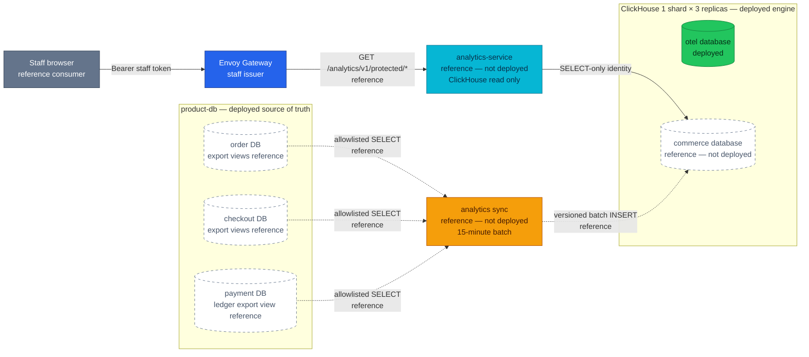
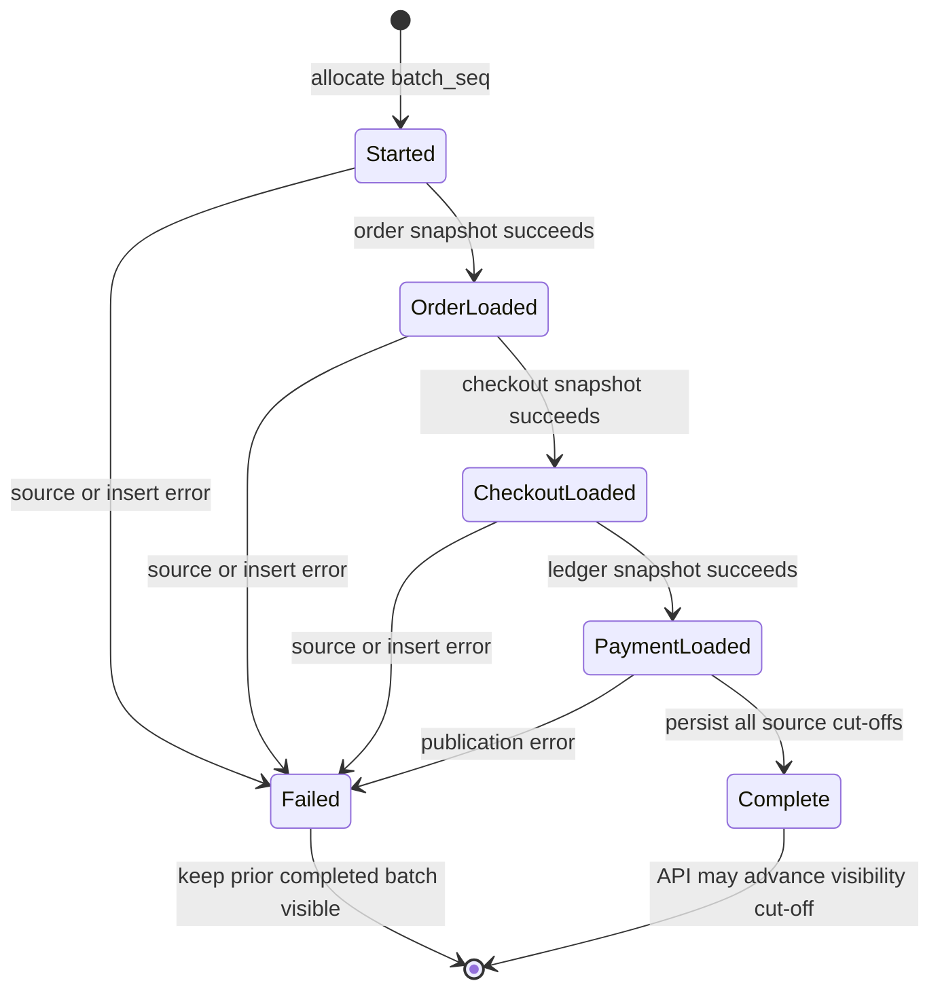
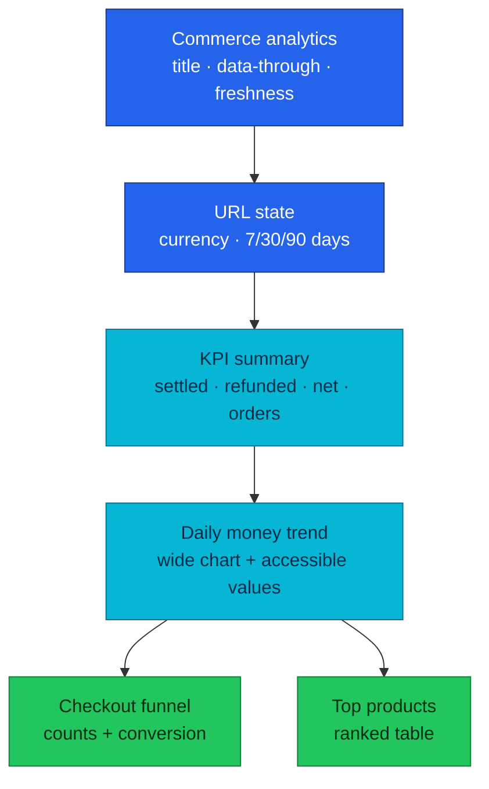
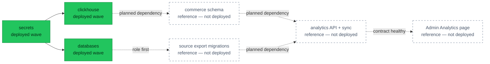

# RFC-0030 — Research: Backoffice commerce analytics on ClickHouse

| | |
|---|---|
| **RFC** | RFC-0030 |
| **Status** | researching |
| **Scope** | platform-wide |
| **Created** | 2026-09-06 |
| **Last updated** | 2026-09-06 |

> **Research only.** Nothing in this document is deployed. Candidate components
> and paths are labelled **reference — not deployed** until an RFC is reviewed,
> accepted, implemented, and reflected in [`docs/api/`](../../../api/README.md).

---

## Table of contents

1. [Problem statement](#problem-statement)
2. [Reading path](#reading-path)
3. [What commerce analytics is](#what-commerce-analytics-is)
4. [Core components](#core-components)
5. [Core mechanism](#core-mechanism)
6. [Glossary](#glossary)
7. [Worked examples](#worked-examples)
8. [Metric semantics](#metric-semantics)
9. [Product and interaction design](#product-and-interaction-design)
10. [vs platform as-built](#vs-platform-as-built)
11. [Integration paths](#integration-paths)
12. [Security and authorization](#security-and-authorization)
13. [Failure model and operations](#failure-model-and-operations)
14. [Alternatives](#alternatives)
15. [Open questions](#open-questions)
16. [FAQ](#faq)
17. [References](#references)
18. [Context7 audit log](#context7-audit-log)
19. [Research review gate](#research-review-gate)

---

## Problem statement

### Real-world trigger

| | |
|---|---|
| **Situation** | A product or operations review asks what converted, what money settled, and which products drove captured orders during the last 7–90 days. The Backoffice can answer live case questions, but it has no historical, cross-domain analytical read model. |
| **Who feels it** | Product and operations need repeatable numbers; finance needs money labels that follow the ledger; platform/on-call must keep analytical scans and failures away from the transactional path. |
| **Why now** | RFC-0023 is implemented, its operational dashboard is stable, and RFC-0019 already reserved commerce facts as an optional future ClickHouse use. ClickHouse now runs as a replicated 1×3 service, so the missing work is a governed data product rather than adopting another database. |
| **If we do nothing** | People either export three PostgreSQL databases by hand, infer revenue from `order.total`, build inconsistent Grafana queries, or add more browser fan-out. Each path produces numbers that are difficult to audit and can load OLTP at review time. |

> **In plain terms:** the portal can show which order is stuck, but it cannot
> safely answer how the business moved over time.

This is not a request for a generic BI warehouse. The concrete first consumer
is the staff Backoffice, and the concrete questions are deliberately bounded:

- daily settled capture, refunds, and net captured amount;
- checkout → order → payment → completion conversion;
- top products within captured orders; and
- whether the displayed data is fresh, stale, or unavailable.

### What homelab practice proves

- A read-only analytical copy can serve 90-day questions without making
  PostgreSQL an interactive OLAP engine.
- A batch can fail halfway without publishing a half-new/half-old dashboard.
- Payment-ledger semantics can remain the money authority while order and
  checkout provide product and funnel context.
- A staff API can expose the result without giving a browser ClickHouse or
  PostgreSQL credentials.
- The feature can fit the existing Admin Portal design system instead of
  introducing a second frontend architecture.

### Success criteria for the research

The research gate passes only when a reviewer can answer all of these without
inventing implementation policy:

1. Which system owns every number?
2. How does a partially failed batch stay invisible?
3. What does stale mean, and what does the operator see?
4. Which credentials exist at each boundary?
5. Why is a new read service justified despite ADR-048?
6. Why is 15-minute batch preferable to CDC for the first slice?
7. How does the page remain recognisably part of the current Backoffice?

---

## Reading path

1. Start with [Metric semantics](#metric-semantics). Storage is secondary to
   agreeing what the numbers mean.
2. Read [Core mechanism](#core-mechanism) for the candidate consistency model.
3. Compare it with reality in [vs platform as-built](#vs-platform-as-built).
4. Use [Alternatives](#alternatives) and [Open questions](#open-questions) for
   the decisions that must be reviewed before an RFC is authored.

---

## What commerce analytics is

Commerce analytics is a **derived read model**. It copies a narrow allowlist of
transactional facts, preserves their business identifiers and timestamps, and
organises them for repeated historical aggregation. It does not accept writes
to orders, payments, refunds, checkout sessions, or products.

> **In plain terms:** PostgreSQL keeps the receipts; ClickHouse keeps a
> query-friendly index of selected receipt facts.

Three properties distinguish this from putting a chart over a SQL query:

1. **Semantic ownership.** Payment ledger postings define settled money;
   checkout sessions define the funnel cohort; order items define historical
   product name, quantity, and item subtotal.
2. **Publication boundary.** A result becomes visible only after all required
   sources reach a common completed batch.
3. **Serving boundary.** A role-gated HTTP API returns bounded aggregates. The
   browser never submits arbitrary SQL and never receives database credentials.

The proposed 15-minute freshness is near-time, not real-time. That is a product
contract: every response must say how far through source history it represents.

---

## Core components

| Component | Role | Candidate state |
|-----------|------|-----------------|
| PostgreSQL export views | Service-owned, column-allowlisted read contracts in `order`, `checkout`, and `payment` | reference — not deployed |
| `analytics_reader` | CNPG-managed login allowed to read only those views | reference — not deployed |
| `analytics sync` | Bounded 15-minute extractor/loader; no business writes | reference — not deployed |
| `commerce` database | ClickHouse database isolated from the existing `otel` database | reference — not deployed |
| Versioned fact tables | Retain source versions and batch identity for retry-safe reads | reference — not deployed |
| `sync_runs` | Records source cut-offs and the publication state of each batch | reference — not deployed |
| `analytics-service` | Staff-authenticated, read-only semantic API over ClickHouse | reference — not deployed |
| Admin `/analytics` page | KPI, trend, funnel, and product views in the existing portal shell | reference — not deployed |

The API process and sync process may share one repository and image, but they
must be separate runtime identities. The API needs ClickHouse `SELECT`; the
sync workload needs PostgreSQL view `SELECT` and ClickHouse `INSERT`. Sharing a
binary must not become sharing authority.

---

## Core mechanism

### Target trust and data path

This diagram answers one question: **where does a commerce fact travel, and
which component may read it?** Every analytics node is reference-only.



**Legend** — grey: human client · blue: platform edge · cyan: service · orange:
batch worker · green: deployed data · dashed: reference, not deployed.

### Completed-batch publication

This diagram answers a different question: **how does a batch become visible?**



ClickHouse does not provide a transaction spanning all fact tables. The
candidate therefore treats `sync_runs` as a publication ledger:

1. Allocate a monotonically increasing `batch_seq`.
2. Read each database in a read-only transaction and record its source cut-off.
3. Insert facts tagged with the batch sequence in meaningful batches.
4. Mark the run `complete` only after all sources and inserts succeed.
5. Query facts only where `batch_seq` is no newer than the latest complete run.

Those source transactions are independent; this is not a distributed
point-in-time snapshot. The response's `data_through` is therefore the minimum
of the completed run's source cut-offs. It must never advertise the newest
individual watermark as though every source had reached it.

A failed attempt can leave physical rows in ClickHouse; those rows are not
logical data until a completed cut-off admits them. Retry overlap is expected,
so query correctness cannot depend on background merges having happened.

### Incremental and reconciliation cycle

- Initial load: the bounded history window, currently 90 days.
- Every 15 minutes: select rows newer than the last completed source watermark,
  with a one-hour overlap to absorb clock edges and retry races.
- Nightly: re-read the bounded retention window to repair missed late changes.
- Watermarks advance only with the completed batch.
- User queries filter to at most 90 days. A possible 100-day physical TTL is
  evaluated as reconciliation headroom, not exposed as product history.

`ReplacingMergeTree` removes equal sorting keys during asynchronous merges; it
does not create an immediate uniqueness constraint. Candidate queries must use
`argMax` over a source version plus batch sequence (or a measured equivalent)
instead of assuming a merged table. `FINAL` remains an option to benchmark, not
the unexplained default for every request.

---

## Glossary

| Term | In plain English |
|------|------------------|
| Analytical copy | Selected source facts optimised for reads; never the transaction authority |
| Cohort | Sessions grouped by when they started, even if they finish later |
| Cut-off | The latest source time a completed batch proves it has examined |
| Fact | A durable observation such as an order item or ledger posting |
| Late change | A source row updated after the batch that first copied it |
| Ledger posting | Balanced payment accounting movement: capture, refund, or reversal |
| Publication | Making one completed batch eligible for API reads |
| Reconciliation | Re-reading a bounded period to repair missed or late source changes |
| Stale | The last complete batch exists but is older than the freshness objective |
| Watermark | Per-source progress saved only after a batch completes |

---

## Worked examples

### Capture, reversal, and refund

For USD ledger postings:

| Event | Amount | Settled capture | Refunded | Net captured |
|-------|-------:|----------------:|---------:|-------------:|
| capture | 10,000 | 10,000 | 0 | 10,000 |
| reversal | 10,000 | 0 | 0 | 0 |
| later capture | 8,000 | 8,000 | 0 | 8,000 |
| partial refund | 2,000 | 8,000 | 2,000 | 6,000 |

The example deliberately does not use order status or `order.total` to infer
money movement. A completed order without a settled payment posting contributes
to neither capture nor net captured amount.

### Currency isolation

| Currency | Net captured minor units |
|----------|-------------------------:|
| USD | 10,000 |
| EUR | 9,000 |

The result is two series. It is never `19,000`, because minor units from
different currencies are not additive without an explicit exchange-rate model,
which is outside this proposal.

### Cohort funnel

Ten checkout sessions start on 2026-09-01 UTC. Eight create orders, six receive
a settled capture, and five complete:

| Stage | Sessions | Conversion from start |
|-------|---------:|----------------------:|
| checkout started | 10 | 100% |
| order created | 8 | 80% |
| payment captured | 6 | 60% |
| order completed | 5 | 50% |

If the sixth order completes on 2026-09-03, the next batch changes the
2026-09-01 cohort to six completions. It does not move that session into the
September 3 cohort.

### Failed batch

Batch 104 loads order and checkout rows, then payment extraction fails. Batch
103 remains the latest complete batch, so the API returns batch 103 with a stale
age. Rows tagged 104 cannot leak into any KPI. The next attempt starts from the
watermarks of 103 and may insert duplicate physical versions; entity-level
deduplication produces one logical result.

### Top product without invented allocation

An order contains product A subtotal 8,000, shipping 500, tax 800, discount 300,
and a later 2,000 refund. Product A reports item subtotal 8,000 and its unit
count. The page does not claim that A generated net revenue of 6,000 because the
source has no item-level allocation for shipping, tax, discount, or refund.

---

## Metric semantics

### Authority table

| Metric | Authority | Rule |
|--------|-----------|------|
| Settled capture | Payment ledger | Sum capture postings minus reversal postings, grouped by currency |
| Refunded | Payment ledger | Sum successful refund postings, grouped by currency |
| Net captured | Payment ledger | Capture minus reversal minus refund |
| Captured orders | Payment ledger joined to payment/order identity | Count distinct orders with positive non-reversed capture |
| Average captured order value | Payment ledger | Settled capture divided by captured-order count; null when denominator is zero |
| Checkout started | Checkout sessions | Count distinct sessions created inside the selected UTC interval |
| Order created | Checkout sessions | Cohort sessions with a durable `order_id` |
| Payment captured | Checkout + payment ledger | Cohort sessions whose linked order has positive settled capture |
| Order completed | Checkout + orders | Cohort sessions whose linked order is `completed` |
| Top products | Order items constrained to captured orders | Quantity, captured-order count, and item subtotal; never named revenue |

### Money and time invariants

- Store and return integer minor units.
- Require one ISO 4217 currency per response.
- Interpret `from` inclusive and `to` exclusive in UTC.
- Preserve product name and price as recorded on the order item; do not join the
  current product catalog and rewrite history.
- Preserve source timestamps. `ingested_at` describes pipeline activity, not
  when the commerce event happened.
- Define `data_through` as the minimum source cut-off in the visible completed
  batch, not the extractor finish time or the newest source watermark.
- A 90-day query limit is an API validation rule even if older physical parts
  still await a TTL merge.

### Proposed API-shaped result

The exact contract belongs in the later RFC and eventually `docs/api/`, but the
research needs a concrete shape to test whether one request can render the page:

```json
{
  "meta": {
    "currency": "USD",
    "from": "2026-08-01",
    "to": "2026-09-01",
    "granularity": "day",
    "generated_at": "2026-09-01T00:16:00Z",
    "data_through": "2026-09-01T00:15:00Z",
    "stale": false
  },
  "pulse": {
    "settled_capture_minor": 10000,
    "refunded_minor": 2000,
    "net_captured_minor": 8000,
    "captured_orders": 4,
    "average_captured_order_minor": 2500
  },
  "trend": [],
  "funnel": [],
  "top_products": []
}
```

Candidate reads are:

```text
GET /analytics/v1/protected/commerce/currencies
GET /analytics/v1/protected/commerce/overview?currency=USD&from=YYYY-MM-DD&to=YYYY-MM-DD
```

These are **reference — not deployed**. They add no command endpoint.

---

## Product and interaction design

The current Admin Portal is not a generic dashboard template. It uses a fixed
sidebar, compact 13px navigation, Geist, neutral shadcn `base-nova` tokens,
small radii, subdued borders, and dense operational tables. The analytical page
must extend those choices instead of introducing gradients, oversized tiles, or
an unrelated colour system.

### Why a separate page

Home answers **what needs attention now** through independent live reads.
Commerce analytics answers **what changed over a historical interval** through
one batch-aligned read model. Mixing them would make a stale analytical number
look as live as an unresolved-payment worklist.

The candidate adds `Analytics` to the existing primary navigation and creates
`/_authenticated/analytics`. It does not replace the Home route.

### Information hierarchy

This diagram explains layout and ownership of page state, not backend topology.



Desktop uses one wide trend followed by funnel and products in a two-column
row. Mobile stacks every region in reading order. The intended controls are:

- URL-owned `currency`, `from`, and `to`, validated by TanStack Router + zod;
- 7/30/90-day presets, defaulting to 30 days;
- TanStack Query for remote state and `AbortSignal` cancellation;
- Recharts through the shadcn chart pattern, using existing `--chart-*` tokens;
- table/text equivalents for chart values; and
- visible UTC labelling instead of silently applying browser local time.

### State contract

| State | Required presentation |
|-------|-----------------------|
| Loading | Skeletons that match the final regions; no page-level spinner |
| Fresh | `Data through` timestamp with a neutral status |
| Stale >30 minutes | Keep last complete values; yellow text/icon badge and age |
| Critically stale >60 minutes | Keep values; prominent red text/icon warning, not colour alone |
| No completed batch | Honest unavailable state; never render fabricated zeroes |
| No business rows | Empty state distinct from pipeline failure |
| 401/403 | Existing login/forbidden behavior |
| Partial source failure | Impossible to see by contract; prior complete batch remains visible |

Accessibility acceptance covers keyboard access, meaningful headings, tooltip
content available outside pointer hover, `prefers-reduced-motion`, contrast, and
axe checks at 320, 768, 1024, and 1440 px.

---

## vs platform as-built

Evidence was read on 2026-09-06 from the listed manifests and sibling service
repositories. Service-repository README tables are not treated as API truth.

| Aspect | Platform today | Candidate delta |
|--------|----------------|-----------------|
| Admin artifact | `admin-service` `fa93861` / v0.4.1, static React/Nginx app | Add one SPA route and API client; keep repository browser-only |
| Admin surface | 13 authenticated screens; 26 operations/23 paths over six services | Two read operations from a seventh service, after implementation |
| Home dashboard | Six independent live TanStack queries for attention cards/recent orders | Remains operational and unchanged |
| UI stack | React 19, strict TypeScript, Vite, TanStack, Tailwind v4, shadcn base-nova | Reuse stack; evaluate Recharts as the only new UI dependency |
| Aggregator | None by ADR-048 | Read-only analytical service only if the revisit trigger is accepted |
| Product DB | CNPG PostgreSQL 18.1, three instances; order/checkout/payment are separate DBs | One least-privilege cross-database reader over service-owned views |
| CNPG roles | Standalone `DatabaseRole` resources per service | Add a non-owning reader; object grants remain outside `DatabaseRole` |
| ClickHouse | 26.7, Altinity operator 0.27.3, 1 shard × 3 replicas, CHK ×3 | Add isolated `commerce` schema/tables |
| ClickHouse data | Replicated `otel` logs/traces only, 90-day TTL | Commerce facts are not deployed |
| ClickHouse identity | Schema Job, Collector, and Grafana use shared `default` credentials | Separate schema/ingest/read identities are required for commerce |
| RFC-0019 Phase A | Optional facts and batch path documented, explicitly not implemented | Replace the sketch with reviewed metric/API/consistency semantics |
| Retention | OTel data has 90-day TTL | Commerce product history target is 90 days; physical headroom unresolved |

### Source schema observations

- Order migrations convert `orders` and `order_items` money to `BIGINT` minor
  units and later add tax, discount, version, and lifecycle timestamps.
- Checkout sessions contain currency, monetary quote components, status,
  `order_id`, and timestamps, but also contain `user_id`, address, promo, and a
  payment-method token that must never enter the analytical export.
- Payment stores intent state and sensitive method/provider fields, while its
  append-only double-entry ledger stores capture/refund/reversal truth.
- Order item names and prices are already point-in-time snapshots, which is the
  correct historical product meaning for this MVP.

Those observations favour service-owned export views: the view is the explicit
place to omit sensitive columns and collapse ledger entries into one posting
amount without teaching an external loader the service's accounting internals.

---

## Integration paths

### Path A — source-owned export views

Each service migration creates an `analytics_export` schema and versioned views.
The platform provisions one CNPG-managed login, exact HBA entries, and the
secret delivery. The role receives view access only.

Benefits:

- column allowlists are reviewed next to source schema changes;
- payment owns how balanced entries become a posting fact;
- adding a sensitive base column does not automatically grant it; and
- the loader cannot bypass the view to scan arbitrary tables.

Cost: three service repositories participate in rollout and the role must exist
before migrations that grant to it run.

### Path B — protected export APIs

Each owning service exposes a paginated internal export contract. This preserves
service boundaries but creates three APIs designed for bulk transfer, repeated
serialization, pagination recovery, and service CPU load. It also makes a
15-minute full/reconciliation scan travel through three application runtimes.

### Path C — PostgreSQL logical CDC

WAL decoding provides lower latency and delete capture, but requires slots,
publication ownership, schema evolution handling, replay offsets, and a durable
consumer. The 15-minute product goal does not currently justify this operational
surface. CDC remains the scale escape hatch, not an MVP badge.

### Candidate Flux order



The later RFC must not make every application depend on ClickHouse merely to
order one analytical workload. A dedicated wave is preferable to adding
`clickhouse-schema` to the global `apps-local` dependency set.

---

## Security and authorization

### PostgreSQL boundary

CloudNativePG 1.30 recommends standalone `DatabaseRole` resources for modern
GitOps role lifecycle. The resource manages role attributes and password/cert
material, is namespace-scoped with its Cluster and Secret, and applies when its
specification or Secret changes. It does not define database/schema/table/view
privileges; those remain PostgreSQL DDL.

Candidate controls:

- `LOGIN`, `NOSUPERUSER`, `NOCREATEDB`, `NOCREATEROLE`, `NOREPLICATION`;
- finite connection limit and read-only transaction defaults;
- exact HBA allow rules for `order`, `checkout`, and `payment` before the final
  reject;
- `databaseRoleReclaimPolicy: retain` for a production-style service identity;
- OpenBAO → ESO basic-auth Secret with `cnpg.io/reload: "true"`;
- read service endpoint and bounded statement/lock timeouts; and
- only `CONNECT`, export-schema `USAGE`, and named-view `SELECT`.

The research deliberately rejects `ALTER DEFAULT PRIVILEGES ... GRANT SELECT ON
TABLES` for this reader. It would silently expose future tables and columns,
including exactly the PII fields this boundary is meant to exclude.

### ClickHouse boundary

ClickHouse supports users, roles, settings profiles, quotas, and host/network
restrictions. The default account is broad and is also relevant to distributed
communication unless that path is configured separately. Commerce should not
extend today's shared `default` credential pattern.

Candidate identities:

| Identity | Minimum capability |
|----------|--------------------|
| `commerce_schema` | Create/alter only the `commerce` database objects owned by GitOps DDL |
| `commerce_ingest` | Insert facts and read/write its specific sync control objects |
| `commerce_read` | Select only the tables/views needed by the API |

Altinity supports user passwords from Kubernetes Secret references in the CHI.
The Context7/operator audit must still verify grants, profiles, quotas, and
update behavior on the pinned 0.27.3 CRD before choosing CHI configuration over
SQL-managed access entities.

### HTTP boundary

- Staff browser → Envoy Gateway → `/analytics/v1/protected/*`.
- Edge validates the staff issuer; `analytics-service` validates issuer again
  and requires `backoffice_admin`, following existing protected-route policy.
- Query parameters are typed and bounded; callers cannot submit SQL, column
  names, arbitrary sort expressions, or unbounded date ranges.
- API pods do not receive PostgreSQL or ClickHouse write credentials.
- Sync pods do not receive staff JWT configuration or serve HTTP business paths.
- All responses use the shared error envelope and avoid caching sensitive staff
  responses in shared intermediaries.

### Explicit data minimisation

Never export:

- OIDC subject / `user_id`;
- address JSON;
- payment method or checkout payment token;
- provider payment/refund references;
- idempotency keys;
- workflow/run identifiers;
- free-form reason fields; or
- reconciliation payload details.

No customer-level drill-down or row-level tenant policy exists in this MVP.

---

## Failure model and operations

| Failure | Read behavior | Operator signal |
|---------|---------------|-----------------|
| One source read fails | Keep prior completed batch | Failed sync counter + Job failure |
| ClickHouse insert fails | New batch remains invisible | Insert error + failed run |
| Loader overlaps itself | Second run must not start | CronJob `concurrencyPolicy: Forbid` |
| Latest batch >30m old | Return 200 with `stale=true` | Warning freshness alert |
| Latest batch >60m old | Return same last-good data with stronger warning | Critical freshness alert |
| No completed batch | Return 503 | Bootstrap/no-data alert and runbook |
| ClickHouse unavailable | Return 503; do not fall through to PostgreSQL | API dependency error and ClickHouse alerts |
| Duplicate source versions | Deduplicate at read cut-off | Duplicate/version diagnostic metric |
| Late refund/order transition | Correct in overlap or nightly reconciliation | Reconciliation changed-row count |

Candidate service metrics include sync duration and outcome, rows per source,
source-watermark lag, completed-batch age, API request duration/errors, and
ClickHouse query duration/errors. Trace spans must separate PostgreSQL extract,
ClickHouse insert, publication, and API query stages without putting SQL values
or business identifiers in span attributes.

Roll back by suspending the sync, removing the API route and Admin navigation,
and leaving isolated analytical tables in place for investigation. No rollback
writes to PostgreSQL and no transaction path depends on analytics availability.

---

## Alternatives

The decision stays open until the research gate. `analytics-service` plus batch
is the primary direction to test, not an already accepted architecture.

| Option | Pros | Cons |
|--------|------|------|
| Existing owning APIs + browser aggregation | No new backend; matches current ADR-048 topology | Cannot establish one completed cut-off; repeats joins/semantics in the browser; historical endpoints do not exist |
| New bulk APIs on three owners + server aggregation | Keeps all reads behind services | Adds three export contracts and repeated application/serialization load for a warehouse-shaped job |
| Direct PostgreSQL query service | Smallest component count | Interactive 90-day scans remain coupled to OLTP; no durable analytical copy |
| Grafana-only commerce panels | Existing ClickHouse client and charting | Engineering UI, not Backoffice product UX; weak contract/role boundary for staff workflows |
| Browser → ClickHouse | Few backend lines | Exposes credentials and arbitrary-query surface; cannot satisfy current trust model |
| Portal-specific `admin-api-service` | Matches the name of ADR-048's escape hatch | Couples the read model to one UI and makes reuse/ownership less clear |
| Read-only `analytics-service` + 15-minute batch | Owns a reusable analytical model; isolates OLTP; explicit freshness and failure semantics | New service, sync job, schema, secrets, alerts, runbook, and cross-repo rollout |
| PostgreSQL CDC → ClickHouse | Lower latency; captures updates/deletes as a stream | Slots, schema evolution, replay, and consumer operations are disproportionate to a 15-minute target |
| Refreshable materialized views | Atomic target replacement and complex scheduled joins | Scheduling/publication moves into ClickHouse while extraction still spans external DBs; cross-source failure boundary needs proof |
| Incremental materialized views | Fast pre-aggregation | Trigger only sees newly inserted blocks, not later merges/updates in other joined sources; easy to double-count versioned facts |
| Cards and tables only | No chart dependency | Trend and conversion shape become slow to scan; fails the primary analytical interaction |
| Recharts through shadcn | Fits React stack, responsive composition, accessibility layer | New dependency and bundle cost; must be measured and cannot override the portal design system |

### Scale escape triggers

The RFC should not adopt CDC speculatively. Revisit batch when representative
evidence shows one of these repeatedly:

- a sync cannot finish inside its 10-minute deadline twice in succession;
- source export query p95 exceeds five seconds after indexing and bounding;
- changed volume exceeds roughly five million rows per day; or
- the product requires materially less than 15-minute freshness.

These are review triggers, not automatic migrations.

---

## Open questions

- [ ] Context7 confirms or corrects ClickHouse 26.7 deduplication, TTL, access,
      insert, and materialized-view claims.
- [ ] Context7 confirms Altinity 0.27.3 CHI grants/profile/quota rendering and
      secret-update behavior.
- [ ] Context7 confirms CNPG 1.30 `DatabaseRole` and read-service behavior.
- [ ] A measured prototype chooses `argMax`, `FINAL`, or a serving table for the
      90-day response under the 500 ms p95 target.
- [ ] Decide whether commerce physical TTL is 90 days exactly or 100 days with
      90 days exposed.
- [ ] Decide whether the nightly reconciliation is a full bounded reread or
      partition/day rotation after measuring source cost.
- [ ] Prove that source rows are append-only/soft-deleted, or add an explicit
      tombstone/partition-replacement contract; polling by `updated_at` cannot
      discover a hard-deleted row.
- [ ] Verify whether the payment export can express one amount per ledger
      transaction without exposing account internals or double-counting legs.
- [ ] Verify Recharts version compatibility and production bundle delta against
      the current React 19/Vite stack.
- [ ] Decide whether the future API returns one overview document or separates
      trend/funnel/products after measuring payload and independent failure needs.
- [ ] Owner sign-off: **ready for RFC**.

---

## FAQ

**Is ClickHouse becoming the source of truth?**

No. A missing or stale analytical row cannot authorize, settle, refund, cancel,
or complete anything. Transactional services continue to use PostgreSQL.

**Why not add these charts to Home?**

Home is a live operational worklist. Historical batch data has a different
freshness contract and deserves an explicit page and timestamp.

**Does “captured” mean revenue?**

No. The MVP deliberately uses settled-capture and refund language. Revenue
recognition requires accounting rules that this platform has not modeled.

**Why not query order totals?**

Order totals describe the commercial order aggregate. The payment ledger
records settled money and its reversals/refunds. The latter is authoritative for
the proposed money KPIs.

**Can a failed batch corrupt the dashboard?**

Physical partial rows may exist, but the API cut-off excludes every batch that
is not marked complete. The last completed batch remains visible and stale.

**Why service-owned PostgreSQL views?**

They give each domain an explicit, versioned place to define safe export
columns and semantics. A broad table grant would silently expand when schemas
change.

**Why no customer cohorts?**

They require a customer analytical identity and privacy/retention model. The
first slice proves aggregate commerce value without copying identity data.

**Why not reuse the shared ClickHouse `default` account?**

The API, loader, schema owner, Collector, and Grafana have different authority.
A shared administrator-like account turns compromise of one consumer into
access to every dataset and operation.

---

## References

### Official product documentation

- [ClickHouse access control and account management](https://clickhouse.com/docs/concepts/features/security/access-rights)
- [ClickHouse deduplication strategies](https://clickhouse.com/docs/concepts/features/operations/insert/deduplication)
- [ClickHouse ReplacingMergeTree](https://clickhouse.com/docs/engines/table-engines/mergetree-family/replacingmergetree)
- [ClickHouse TTL](https://clickhouse.com/docs/concepts/features/operations/delete/ttl)
- [ClickHouse insert strategy](https://clickhouse.com/docs/best-practices/selecting-an-insert-strategy)
- [ClickHouse refreshable materialized views](https://clickhouse.com/docs/concepts/features/materialized-views/refreshable-materialized-view)
- [ClickHouse incremental materialized views](https://clickhouse.com/docs/concepts/features/materialized-views)
- [Altinity operator security hardening](https://github.com/Altinity/clickhouse-operator/blob/master/docs/security_hardening.md)
- [CloudNativePG 1.30 declarative role management](https://cloudnative-pg.io/docs/1.30/declarative_role_management/)
- [Recharts API](https://recharts.github.io/en-US/api/)
- [shadcn chart component](https://ui.shadcn.com/docs/components/chart)
- [TanStack Router search parameters](https://tanstack.com/router/latest/docs/framework/react/guide/search-params)
- [TanStack Query query cancellation](https://tanstack.com/query/latest/docs/framework/react/guides/query-cancellation)

### Repository evidence

- [RFC-0019](../RFC-0019/) — deployed OTel phase and optional commerce sketch
- [RFC-0023](../RFC-0023/) — implemented Backoffice program
- [RFC-0028](../RFC-0028/) and [ADR-065](../../adr/ADR-065-clickhouse-replicated-topology/) — replicated ClickHouse and Job-owned schema
- [ADR-048](../../adr/ADR-048-admin-portal-no-bff/) — current direct-call decision and read-aggregation trigger
- [Admin consumer contract](../../../api/admin.md)
- [Admin Portal platform guide](../../../frontend/admin-portal/README.md)
- [ClickHouse platform guide](../../../observability/clickhouse/README.md)
- [`product-db` cluster](../../../../kubernetes/infra/configs/databases/clusters/product-db/instance.yaml)
- [ClickHouse installation](../../../../kubernetes/infra/configs/clickhouse/clickhouseinstallation.yaml)

### Sibling repository evidence read 2026-09-06

- `admin-service` `fa93861`: route tree, AppShell, theme tokens, package manifest,
  dashboard, and Playwright specifications.
- `order-service` `ff7afe0`: migrations 000001, 000006, 000007, and 000011.
- `checkout-service` `5ab15c6`: checkout session and item migrations.
- `payment-service` `7672982`: payment/refund, ledger, and attempt migrations;
  ledger repository posting semantics.

---

## Context7 audit log

Context7 is not exposed by the current tool session. Primary official sources
were read directly to prevent the research from being empty, but that is not
represented as a completed Context7 audit. Every row stays **pending** until an
actual Context7 query is captured and any correction is applied.

| Claim / section | Source to check | Result |
|-----------------|-----------------|--------|
| ReplacingMergeTree dedup is merge-time and query correctness needs explicit dedup | ClickHouse 26.7 engine + dedup docs | pending Context7 |
| `argMax` vs `FINAL` behavior and cost | ClickHouse 26.7 query/engine docs | pending Context7 + benchmark |
| TTL expiry is applied by merges and may outlive the logical query window | ClickHouse 26.7 TTL docs | pending Context7 |
| Batch insert sizing and acknowledgement | ClickHouse 26.7 insert strategy | pending Context7 |
| Incremental MV sees inserted blocks, not later source-table change | ClickHouse 26.7 MV docs | pending Context7 |
| Refreshable MV replacement/replication semantics | ClickHouse 26.7 refreshable MV docs | pending Context7 |
| Users/roles/profiles/quotas and `default` account behavior | ClickHouse 26.7 access docs | pending Context7 |
| CHI secret-backed users and grant rendering | Altinity operator 0.27.3 | pending Context7 |
| DatabaseRole is namespace-scoped and reconciles on spec/Secret change | CNPG 1.30 role docs | pending Context7 |
| DatabaseRole does not own PostgreSQL object grants | CNPG 1.30 API/docs | pending Context7 |
| Search params remain URL-owned in the existing frontend stack | TanStack Router current docs | pending Context7 |
| Query cancellation consumes AbortSignal | TanStack Query current docs | pending Context7 |
| Recharts accessibility and React 19 support | Recharts current docs/package peer range | pending Context7 |

---

## Research review gate

- [x] Answers a real design-review problem rather than a vendor-evaluation exercise
- [x] Problem statement names the situation, audience, timing, and cost of doing nothing
- [x] Multiple plausible integration and product alternatives carry explicit costs
- [x] Platform as-built section is grounded in manifests, trusted API docs, and source migrations
- [x] Primary candidate is stated without declaring an architecture decision accepted
- [ ] Context7 audit complete; every pending row confirmed/corrected/rejected
- [x] Four Mermaid diagrams distinguish deployed from reference components
- [x] No Kubernetes manifest or application implementation is included
- [x] No customer PII or payment credential is proposed for export
- [ ] `argMax`/`FINAL` serving choice benchmarked against a representative 90-day dataset
- [ ] Open questions resolved or explicitly deferred by the owner
- [ ] Owner sign-off: **ready for RFC**

---
_Last verified: 2026-09-06 (official docs + manifest/source cross-check; Context7 pending)._
