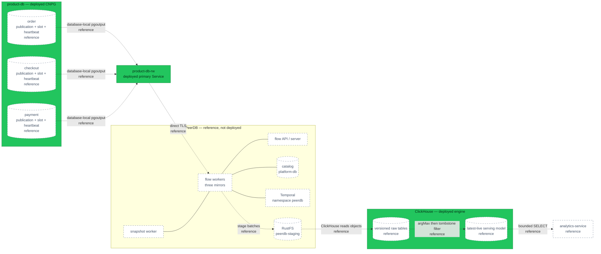
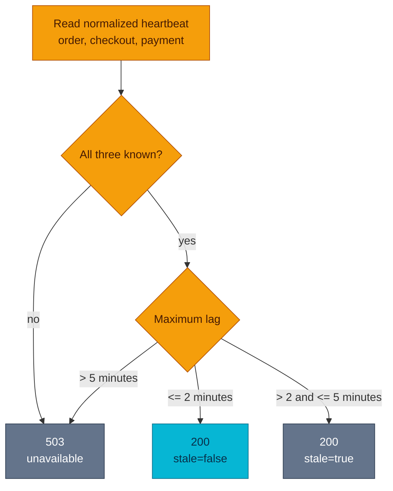

# RFC-0030 — Research: PeerDB commerce analytics

| | |
|---|---|
| **RFC** | RFC-0030 |
| **Status** | researching → PeerDB research gate passed with provisional RFC |
| **Scope** | platform-wide |
| **Created** | 2026-09-06 |
| **Last updated** | 2026-09-08 |

> **Research only.** PeerDB, commerce objects, heartbeat writers, and analytics
> workloads are **reference — not deployed** until the RFC and resulting ADRs
> are accepted and implementation is verified.

## Table of contents

1. [Problem statement](#problem-statement)
2. [Reading path](#reading-path)
3. [What PeerDB changes](#what-peerdb-changes)
4. [Core components](#core-components)
5. [Core mechanism](#core-mechanism)
6. [Glossary](#glossary)
7. [Worked examples](#worked-examples)
8. [Metric semantics](#metric-semantics)
9. [Source contract](#source-contract)
10. [Freshness contract](#freshness-contract)
11. [vs platform as-built](#vs-platform-as-built)
12. [Security and authorization](#security-and-authorization)
13. [Failure model and operations](#failure-model-and-operations)
14. [Schema evolution](#schema-evolution)
15. [Reconciliation](#reconciliation)
16. [Product and API boundary](#product-and-api-boundary)
17. [Alternatives](#alternatives)
18. [Remaining validation](#remaining-validation)
19. [FAQ](#faq)
20. [References](#references)
21. [Context7 audit log](#context7-audit-log)
22. [Research review gate](#research-review-gate)

## Problem statement

Product and operations need repeatable 7–90-day answers for settled money,
refunds, checkout conversion, and top products. Backoffice can investigate live
cases, but it has no historical cross-domain read model. Manual exports,
browser fan-out, and repeated OLTP scans produce unauditable numbers or couple
review traffic to transactional databases.

The earlier RFC draft proposed a custom 15-minute batch. Owner review selected
PeerDB instead: continuous CDC avoids building snapshot, checkpoint, retry, and
delete handling ourselves. That choice creates a different production problem:
logical slots can retain WAL, PeerDB has a stateful control plane, schema
evolution is not transparent, and “workflow running” does not prove fresh data.

Research succeeds when a reviewer can explain:

1. what PeerDB owns and what the platform still owns;
2. the exact tables and columns allowed to leave PostgreSQL;
3. snapshot, catch-up, update, delete, and deduplication behavior;
4. how freshness is proved during idle traffic;
5. failure and recovery for every stateful dependency;
6. the accepted source-credential risk;
7. why a thin API remains necessary; and
8. why no PostgreSQL analytical extension is selected.

## Reading path

1. Start with [Metric semantics](#metric-semantics).
2. Read [Source contract](#source-contract) for the security boundary.
3. Read [Core mechanism](#core-mechanism) and
   [Freshness contract](#freshness-contract) for transport and consistency.
4. Read [Failure model and operations](#failure-model-and-operations) before
   treating CDC as automatic.
5. Use [Remaining validation](#remaining-validation) as the acceptance gate.

## What PeerDB changes

PeerDB is the ingestion transport, not the analytics product. It performs an
initial snapshot of mapped tables, then consumes PostgreSQL logical WAL into
ClickHouse. It owns stream checkpoints, batching, retry, and the physical
version/tombstone representation. The platform still owns:

- metric definitions and cross-domain joins;
- source grants, publications, HBA, and WAL capacity;
- PII policy and downstream inspection;
- ClickHouse serving objects;
- staff authentication and authorization;
- public freshness semantics;
- reconciliation and incident response; and
- source schema-change coordination.

Three databases require three mirrors. Publications, slots, snapshots, LSNs,
and heartbeats are database-local even though `order`, `checkout`, and
`payment` share one CNPG cluster.

## Core components

| Component | Responsibility | Candidate state |
|-----------|----------------|-----------------|
| Three CNPG `Publication` resources | Reconcile reviewed tables, columns, operations as GitOps | reference — not deployed |
| Three PeerDB source logins | Snapshot and logical replication for one database each | reference — not deployed |
| Three heartbeat rows/writers | Prove the complete idle-traffic path | reference — not deployed |
| PeerDB flow/snapshot workers | Initial copy, WAL consumption, staging, ClickHouse load | reference — not deployed |
| PeerDB control API/server | Mirror lifecycle; cluster-internal only | reference — not deployed |
| PeerDB catalog | Dedicated database/role on `platform-db` | reference — not deployed |
| Temporal namespace `peerdb` | Isolated workflows on the deployed Temporal server | reference — not deployed |
| RustFS `peerdb-staging` | Dedicated bucket, identity, quota, lifecycle | reference — not deployed |
| ClickHouse raw tables | PeerDB versions and tombstones | reference — not deployed |
| ClickHouse serving model | Latest-live rows and commerce aggregates | reference — not deployed |
| `analytics-service` | Staff read API and reconciliation command | reference — not deployed |

The upstream Kubernetes shape includes `flow-worker`,
`flow-snapshot-worker`, `flow-api`, `peerdb-ui`, and `peerdb-server`, plus a
PostgreSQL catalog and Temporal. ClickHouse ingestion also needs object storage;
both PeerDB and ClickHouse must reach the staging endpoint.

## Core mechanism

This diagram answers one question: **how do three database-local streams reach
the serving model?** Every CDC-specific object is reference-only.



**Legend** — green: deployed data boundary · dashed border/dotted edge:
reference, not deployed.

### Initial snapshot and catch-up

1. Reconcile the reviewed CNPG `Publication` and source role.
2. Start one database mirror.
3. PeerDB records a snapshot position and copies every row from mapped tables.
   This is a full snapshot, not a 90-day filtered extract.
4. PostgreSQL retains WAL from the slot position while the copy runs.
5. PeerDB loads staged snapshot data, then applies accumulated changes.
6. Start the next mirror only after measuring source, WAL, staging, and
   ClickHouse load.

The snapshot worker must remain available and version-compatible throughout
initial load. The upstream upgrade guide warns that replacing it mid-snapshot
can fail the copy.

### Updates, deletes, and serving

PeerDB maps inserts to raw rows, updates to newer versions, and deletes to
tombstone versions. ClickHouse merges do not provide immediate uniqueness. The
serving logic is conceptually:

```sql
SELECT
  id,
  argMax(status, _peerdb_version) AS status,
  argMax(_peerdb_is_deleted, _peerdb_version) AS is_deleted
FROM commerce_raw.orders
GROUP BY id
HAVING is_deleted = 0
```

Production queries need `argMax` for every selected value or an equivalent
tested view. `FINAL` is reserved for diagnosis and verification. Publication
column lists must contain primary/replica-identity columns so updates and
deletes remain identifiable.

### Cross-database consistency

There is no distributed snapshot, common transaction, or common LSN. Payment
may reach ClickHouse before its order update. The contract is bounded eventual:

- every source has an independent target-observed watermark;
- `data_through` is their minimum;
- the watermark is a conservative progress statement; results may already
  contain later independent facts and do not become a distributed snapshot; and
- reconciliation mismatch is an operational error, not evidence of a global
  transaction.

## Glossary

| Term | Meaning |
|------|---------|
| CDC | Continuous capture of committed database changes |
| Initial snapshot | First full copy of selected tables |
| LSN | PostgreSQL WAL position within a stream |
| Publication | Database-local allowlist of tables, columns, and operations |
| Replication slot | State that retains WAL until acknowledged |
| Mirror | One PeerDB source-to-destination flow |
| Tombstone | New version marking a source row deleted |
| Target-observed heartbeat | Source timestamp visible after ClickHouse normalization |
| `data_through` | Oldest target-observed heartbeat across the three sources |
| Reconciliation | Independent source/target correctness comparison |
| Resync | Rebuild when a mirror/slot cannot safely resume |

## Worked examples

### Capture, reversal, and refund

| Event | Amount | Settled capture | Refunded | Net captured |
|-------|-------:|----------------:|---------:|-------------:|
| capture | 10,000 | 10,000 | 0 | 10,000 |
| reversal | 10,000 | 0 | 0 | 0 |
| later capture | 8,000 | 8,000 | 0 | 8,000 |
| partial refund | 2,000 | 8,000 | 2,000 | 6,000 |

Money comes from ledger transactions joined to the `merchant_revenue` account
leg. Order status and total never manufacture a settled payment.

### Cross-source lag

At 10:00:30 UTC, ClickHouse contains:

| Source | Heartbeat | Lag | State |
|--------|-----------|----:|-------|
| order | 10:00:00 | 30s | healthy |
| checkout | 09:58:40 | 110s | healthy |
| payment | 09:57:50 | 160s | stale |

The API returns `200`, `stale=true`, and
`data_through=09:57:50`. Above five minutes it returns `503`. It never promotes
the order timestamp into a cross-source guarantee.

### Idle stream and delete

No order is created for an hour. `RUNNING` does not prove freshness. Seeing the
10:00 heartbeat in normalized ClickHouse proves source → WAL → PeerDB → staging
→ ClickHouse advanced. Separately, an update creates a newer raw version and a
delete creates a tombstone; duplicate delivery still yields one latest logical
row, removed after the tombstone.

## Metric semantics

| Metric | Authority | Rule |
|--------|-----------|------|
| Settled capture | Payment ledger | Capture less reversal, per currency |
| Refunded | Payment ledger | Successful refund postings, per currency |
| Net captured | Payment ledger | Capture minus reversal minus refund |
| Captured orders | Ledger via payment/order identity | Distinct orders with positive non-reversed capture |
| Average captured order | Ledger | Settled capture / captured orders; null at zero |
| Checkout started | Checkout sessions | Cohort created inside selected UTC interval |
| Order created | Checkout sessions | Cohort sessions with durable `order_id` |
| Payment captured | Checkout + ledger | Cohort sessions with positive settled capture |
| Order completed | Checkout + orders | Cohort sessions whose order is `completed` |
| Top products | Order items in captured orders | Quantity, order count, item subtotal; never named revenue |

Amounts remain integer minor units, one currency per response. `from` is
inclusive and `to` exclusive in UTC. Order-item names/prices are historical.
Source `order_id` types (`integer`, `text`, `bigint`) normalize to ClickHouse
`String` without changing transactional schemas.

## Source contract

| Database | Base table | Published/mirrored columns |
|----------|------------|----------------------------|
| `order` | `orders` | `id`, `status`, `version`, `created_at`, `updated_at`, `completed_at` |
| `order` | `order_items` | `id`, `order_id`, `product_id`, `product_name`, `quantity`, `price`, `subtotal`, `created_at` |
| `checkout` | `checkout_sessions` | `id`, `status`, `order_id`, `currency`, `created_at`, `updated_at` |
| `payment` | `payments` | `id`, `order_id`, `currency`, `created_at`, `updated_at` |
| `payment` | `ledger_transactions` | `id`, `payment_id`, `kind`, `created_at` |
| `payment` | `ledger_entries` | `id`, `transaction_id`, `account_id`, `direction`, `amount_minor` |
| `payment` | `ledger_accounts` | `id`, `name`, `type` |

All seven tables have primary keys. `orders.version` and `completed_at` exist in
the current status-model migration. Checkout omits addresses, shipping, quote
amounts, promo, expiry, and payment token. Payment derives money from the ledger
instead of treating payment intent amount/status as accounting truth.

Each database also receives one operational table:

```sql
CREATE TABLE analytics_cdc_heartbeat (
  id SMALLINT PRIMARY KEY CHECK (id = 1),
  emitted_at TIMESTAMPTZ NOT NULL
);
```

A separate per-database writer receives only `INSERT`/`UPDATE` on this table and
updates its fixed row every 30 seconds with PostgreSQL `clock_timestamp()`.
This avoids treating the writer pod's clock as source time; platform clock skew
still needs monitoring. The future analytics image can expose this small
command; it is not an ingestion engine.

### Two allowlist layers

CNPG 1.30 can reconcile a `Publication` per database with explicit table and
`columns` objects. Use that resource with reclaim policy `retain`, and require
`status.applied=true` plus the current `observedGeneration` before starting its
mirror. PeerDB is an external consumer, so this design does not create a CNPG
`Subscription`.

PostgreSQL publication column lists are positive WAL allowlists. PeerDB
documents mirror-side exclusions. Both are generated/reviewed from the same
contract so schema additions do not silently widen the destination:

1. the publication limits logical change content;
2. exhaustive PeerDB exclusions limit snapshot/mapping behavior.

The prototype must prove this combination for snapshot, update, and delete.
PeerDB's official docs do not explicitly guarantee every PostgreSQL column-list
publication behavior, so this remains an acceptance gate.

Forbidden downstream data includes `user_id`, address JSON, shipping/promo
data, payment method/token, provider identifiers, `external_ref`,
decline/reason text, idempotency material, workflow IDs, and audit actor/note
data.

## Freshness contract

The Mirror Status API reports lifecycle state, but its CDC progress is still
documented as “coming soon”. CDC batches start after a change event, so their
last end time is not an idle-stream authority. LSN/slot metrics help operators
but do not prove a timestamp reached the serving model. Upstream also rejected
PostgreSQL keepalive-based zero lag because a large transaction may still be
decoding.

PeerDB's built-in heartbeat interval is 12 minutes. Its official guide shows a
faster `pg_cron` heartbeat, but `pg_cron` is not installed here and would add
extension packaging, activation, upgrade, and restore work. A narrow
30-second writer changes fewer database lifecycle assumptions.



`data_through` is the minimum of three target-observed `emitted_at` values, not
a transaction boundary. If the freshness query fails, the answer is unknown
and the API returns `503`.

## vs platform as-built

| Aspect | Platform today | Candidate delta |
|--------|----------------|-----------------|
| Product DB | CNPG PostgreSQL 18.1, three instances, synchronous `ANY 1` | Three direct-primary PeerDB connections |
| Logical settings | `wal_level=logical`, `max_wal_senders=10`, slot sync settings enabled | Size slots/senders/WAL cap; prove external slot failover |
| HBA/pooling | Exact pairs then reject-all; PgDog for app traffic | Exact PeerDB/heartbeat pairs; CDC bypasses PgDog |
| Temporal | Deployed with PostgreSQL persistence | Dedicated namespace `peerdb` |
| RustFS | Backups and ClickHouse cold tier | Dedicated staging bucket/identity |
| `platform-db` | Hosts platform databases | Dedicated PeerDB catalog DB/role |
| ClickHouse | 26.7, 1 shard × 3 replicas, `otel` data | Isolated commerce raw/serving objects |
| Extensions | `pgaudit`, `pg_stat_statements`, `auto_explain`; limited `pgcrypto`/`uuid-ossp` | No new extension |
| PeerDB | Not deployed | New stateful control/worker plane |

Current logical settings are prerequisites, not proof. CNPG documents logical
slot synchronization on PostgreSQL 17+, but PeerDB owns its consumer slot
rather than a CNPG Subscription. Switchover/failover must prove that exact slot
and reconnection through `product-db-rw`, or recovery must require resync.

## Security and authorization

PeerDB's snapshot requires table `SELECT`. Publication columns constrain WAL but
do not narrow SQL table reads. Each source credential can therefore read every
column in its selected tables even when forbidden columns never reach
ClickHouse. The owner explicitly accepted this drawback.

Mandatory compensating controls:

- one non-owner/non-superuser login per database;
- `LOGIN`, `REPLICATION`, exact-table `SELECT`; never schema-wide defaults;
- no `BYPASSRLS` because these tables do not use RLS;
- CNPG-managed publications with source-owner-reviewed targets; PeerDB receives
  no DDL;
- exact HBA pairs, TLS, NetworkPolicy, OpenBAO/ESO rotation, and audit;
- publication allowlists plus exhaustive PeerDB exclusions; and
- downstream PII inspection before route exposure.

| Identity | Allowed | Denied |
|----------|---------|--------|
| Source migration owner | Heartbeat table DDL and exact grants | PeerDB/ClickHouse runtime |
| CNPG publication reconciler | Three named database-local publications | PeerDB mirror/slot lifecycle |
| PeerDB login ×3 | Connect, replication, selected-table snapshot | Ownership, DDL, business writes |
| Heartbeat writer ×3 | Upsert one fixed heartbeat row | Business-table access |
| Catalog role | Its `platform-db` catalog only | Other databases |
| Staging identity | `peerdb-staging` only | Backup/cold-tier buckets |
| ClickHouse ingest | Mapped raw objects | Staff/source access |
| ClickHouse read | Serving objects | Raw writes/source access |
| Analytics API | Bounded read after staff auth | Source/catalog/staging credentials |

PeerDB UI/control APIs remain internal. Envoy and the API validate the staff
issuer; the API additionally requires `backoffice_admin`.

PeerDB core is AGPL-3.0. The official enterprise chart repository is ELv2,
including a managed-service restriction. Internal use appears compatible with
that wording, but acceptance requires an explicit license review.

## Failure model and operations

| Failure | Contract | Operator invariant |
|---------|----------|--------------------|
| Source lag 2–5m | `200 stale=true` | Identify source; inspect heartbeat/slot/path |
| Lag >5m or unknown | `503` | Never claim unverifiable freshness |
| PeerDB restart | Lag rises | Prove checkpoint resume and deduplication |
| Snapshot interruption | Route stays absent | Preserve compatible snapshot worker; resume/restart |
| ClickHouse/RustFS outage | Eventually `503` | Bound staging and retained WAL |
| Temporal/catalog/control loss | Progress may stop | Preserve slot and diagnose isolated dependency |
| Network partition | Slot retains WAL | Restore before WAL cap invalidates slot |
| WAL-cap invalidation | `503` | Resync from a new safe position |
| CNPG promotion | Unknown until drilled | Reconnect via RW Service or resync |
| Schema DDL | Gate/pause mirror | Coordinate every contract layer |
| Secret rotation | Brief reconnect only | Prove new connection and old-secret rejection |
| PII leak | Remove route; pause mirror | Preserve evidence and run reviewed purge |

Logical slots can exhaust PostgreSQL disk while a consumer lags.
`max_slot_wal_keep_size` must be finite and measured. The cap exchanges disk
safety for possible invalidation/resync. Monitor active/invalidation state,
retained bytes/time, restart/flush positions, and disk headroom.

PeerDB resync performs another source copy into replacement tables and can
create a new slot. It is not a cheap retry. Dropping a mirror may drop its slot,
so “delete and recreate” is never the first incident action.

Required drills cover concurrent snapshot writes; insert/update/delete;
duplicates; large transactions; every dependency outage; network partitions;
credential rotation; CNPG switchover/failover; WAL invalidation/resync;
add/drop/type DDL; and PII inspection.

## Schema evolution

Official material is inconsistent: the schema-change page does not clearly
promise ClickHouse propagation, the feature matrix marks it supported, and an
open issue reports PostgreSQL → ClickHouse `ADD COLUMN` normalization failure.
Use a conservative policy:

1. classify every mapped-table DDL before merge;
2. gate/pause the affected mirror;
3. update publication, exclusion map, raw schema, serving schema, and
   reconciliation together;
4. keep new columns excluded until tested;
5. resync incompatible drop/type changes unless the pinned build proves a safe
   path; and
6. run regular source/destination schema-drift checks.

## Reconciliation

A small `analytics-service reconcile` command/job checks:

- nightly: the latest seven UTC days;
- weekly: the full 90-day product window;
- source/day/currency counts and stable sums/checksums;
- bounded slice repair only after evidence is preserved; and
- alerting on mismatch, skipped run, or query failure.

It does not advance freshness, own WAL offsets, or provide a parallel ingestion
path.

## Product and API boundary

The one planned operation is:

```text
GET /analytics/v1/protected/commerce/overview?currency=USD&from=YYYY-MM-DD&to=YYYY-MM-DD
```

It returns bounded KPIs, trend, funnel, top products, `generated_at`,
`data_through`, `stale`, and three source records containing `name`,
`synced_at`, `lag_seconds`, and `healthy|stale|unavailable`.

PeerDB cannot replace this service. The browser must not hold ClickHouse
credentials, submit SQL, implement ledger joins, interpret tombstones, or make
freshness decisions. This is the narrow read aggregation escape hatch
anticipated by ADR-048.

The Admin page uses its current authenticated lazy-route, TanStack,
shadcn/Tailwind, UTC, accessible table-equivalent patterns. Home stays the live
operational dashboard.

## Alternatives

### Transport

| Option | Strength | Position |
|--------|----------|----------|
| PeerDB | Purpose-built snapshot/CDC, no broker, updates/deletes | Provisional choice; acceptance gates remain |
| Custom 15-minute batch | Smaller infrastructure surface | Rejected runner-up; team owns transport correctness |
| Debezium + Kafka | General event backbone and replay | Disproportionate for one consumer |
| Custom `pgoutput` | Maximum control | Permanent decoding/checkpoint/support burden |
| ClickHouse `MaterializedPostgreSQL` | Fewer components | Experimental/maturity and DDL constraints |
| Export APIs | Service boundary preserved | Three bulk APIs and application load |

Do not build batch beside PeerDB. Two transports double correctness and on-call
surface. Batch returns only if PeerDB fails a hard prototype gate.

### PostgreSQL extensions

| Extension/family | Useful capability | Why not selected |
|------------------|-------------------|------------------|
| `pg_cron` | Source-local heartbeat schedule | Not deployed; extension lifecycle for one operational row |
| `pg_duckdb` | Embedded analytics/external formats | Native packaging/preload/DR; still three source boundaries |
| `pg_mooncake` | Columnar warehouse behavior | New storage/extension lifecycle; does not solve semantics |
| TimescaleDB | Time-series aggregates/refresh | Does not provide this CDC/ClickHouse boundary |
| Citus/columnar | Distributed/columnar PostgreSQL | Larger topology change with same ownership problem |
| `postgres_fdw` + materialized views | Cross-DB SQL and refresh | Central PostgreSQL becomes integration/OLAP engine |

None replaces PostgreSQL → ClickHouse CDC. Any native extension must pass the
platform's PostgreSQL 18 artifact, OS, architecture, preload, upgrade, and
restore policy.

## Remaining validation

Before `Accepted`:

1. Pin a compatible released chart/image pair and digests. The audit found core
   v0.37.5 while released enterprise chart v0.9.16 packages an older app.
2. Approve AGPL-3.0/ELv2 use.
3. Prove column-list publications plus PeerDB exclusions for snapshot/update/delete.
4. Prove 30-second target heartbeats ≤2m during idle, busy, and recovery.
5. Verify version/tombstone behavior on the pinned build.
6. Execute add/drop/type DDL and document recovery.
7. Prove PeerDB slot behavior through CNPG switchover/failover or require resync.
8. Measure full snapshot, WAL, staging, raw storage, and resource floor.
9. Complete failure drills, alerts, dashboard, and runbook.
10. Load one million facts; match 7/30/90-day checksums; prove `argMax` p95
    ≤500 ms, query memory ≤512 MiB, and no pod restart.

## FAQ

### Is CDC needed for transactions?

No. No transactional request waits for PeerDB or ClickHouse.

### Does two minutes mean a two-minute CronJob?

No. It is an end-to-end SLO. PeerDB streams continuously; a 30-second heartbeat
makes idle progress measurable.

### Why not mirror status or the newest business row?

Status proves workflow state, not target progress. Idle tables have no new
business row; recent source rows can be stuck before ClickHouse.

### Why not PeerDB's built-in heartbeat?

Its documented 12-minute interval exceeds the SLO.

### Why not `pg_cron`?

It is valid and appears in official PeerDB guidance, but is not installed. A
narrow command in the planned analytics image changes less CNPG lifecycle.

### Is table `SELECT` least privilege?

Only at table scope. The credential can read forbidden columns in selected
tables. This accepted weakness drives per-database roles, exact grants,
allowlists/exclusions, network isolation, and downstream inspection.

### Is `data_through` a consistent snapshot?

No. It is the oldest of three independently target-observed heartbeats.

### What if PeerDB fails the prototype?

The RFC remains provisional and may explicitly return to batch. Both transports
will not run in parallel.

## References

### PeerDB

- [PostgreSQL source requirements](https://docs.peerdb.io/connect/postgres/generic_postgres)
- [PostgreSQL to ClickHouse CDC](https://docs.peerdb.io/mirror/cdc-pg-clickhouse)
- [ClickHouse staging requirements](https://docs.peerdb.io/connect/clickhouse/clickhouse)
- [ClickHouse data modelling](https://docs.peerdb.io/bestpractices/clickhouse_datamodeling)
- [Heartbeat guidance](https://docs.peerdb.io/bestpractices/heartbeat)
- [Mirror Status API](https://docs.peerdb.io/peerdb-api/endpoints/mirror-status)
- [CDC Batches API](https://docs.peerdb.io/peerdb-api/endpoints/cdc-batches)
- [Native metrics](https://docs.peerdb.io/metrics/native-metrics)
- [Schema changes](https://docs.peerdb.io/features/schema-changes)
- [Feature matrix](https://docs.peerdb.io/features/feature-matrix)
- [Mirror resync](https://docs.peerdb.io/features/resync-mirror)
- [Mirror upgrades](https://docs.peerdb.io/mirror/upgrade)
- [PeerDB v0.37.5](https://github.com/PeerDB-io/peerdb/releases/tag/v0.37.5)
- [Core license](https://github.com/PeerDB-io/peerdb#license)
- [Enterprise chart v0.9.16](https://github.com/PeerDB-io/peerdb-enterprise/releases/tag/v0.9.16)
- [Enterprise chart license](https://github.com/PeerDB-io/peerdb-enterprise/blob/main/LICENSE.md)
- [Commit-lag semantics](https://github.com/PeerDB-io/peerdb/pull/4573)
- [Open ClickHouse schema issue](https://github.com/PeerDB-io/peerdb/issues/4310)

### PostgreSQL, CNPG, ClickHouse, and repository

- [PostgreSQL 18 logical replication security](https://www.postgresql.org/docs/18/logical-replication-security.html)
- [PostgreSQL 18 `CREATE PUBLICATION`](https://www.postgresql.org/docs/18/sql-createpublication.html)
- [PostgreSQL 18 replication configuration](https://www.postgresql.org/docs/18/runtime-config-replication.html)
- [CloudNativePG 1.30 declarative logical replication](https://cloudnative-pg.io/docs/1.30/logical_replication/)
- [CloudNativePG 1.30 replication](https://cloudnative-pg.io/docs/1.30/replication/)
- [ClickHouse `ReplacingMergeTree`](https://clickhouse.com/docs/engines/table-engines/mergetree-family/replacingmergetree)
- [PostgreSQL extension inventory](../../../databases/extensions.md)
- [Database architecture](../../../databases/architecture.md)
- [ClickHouse platform guide](../../../observability/clickhouse/README.md)
- [Admin consumer contract](../../../api/admin.md)
- [ADR-048](../../adr/ADR-048-admin-portal-no-bff/)

## Context7 audit log

Context7 was rerun on 2026-09-08 after the PeerDB pivot. It indexes upstream
repository material, often from `main`, so version-sensitive claims were
cross-checked against versioned official releases/pages above.

| Library ID | Query | Result and disposition |
|------------|-------|------------------------|
| `/peerdb-io/peerdb` | PostgreSQL → ClickHouse prerequisites, snapshot, changes, mapping, heartbeat, status | Confirmed snapshot/`pgoutput`/update/delete/exclusion shapes; MVP-critical and version-audited |
| `/peerdb-io/peerdb-enterprise` | Kubernetes services, catalog, Temporal, object storage, versions | Confirmed control-plane shape; released chart/app mismatch is an acceptance blocker |
| `/cloudnative-pg/cloudnative-pg` | PostgreSQL 18 slot synchronization and WAL cap | Matches deployed settings; PeerDB-created slot still requires failover drill |

Context7 did not establish an idle-stream freshness API. Official
documentation/source audit found incomplete Mirror Status progress,
event-triggered CDC batches, and rejected keepalive-based zeroing. That negative
finding directly produced the target-observed heartbeat requirement.

## Research review gate

| Gate | Result |
|------|--------|
| Real problem and bounded consumer | Pass |
| Metric authority | Pass |
| Source schema and PII boundary | Pass with accepted table-read drawback |
| PeerDB mechanism and dependencies | Pass for provisional RFC |
| Freshness authority | Pass for design via target heartbeat |
| Platform and extension reality | Pass |
| Context7 plus primary sources | Pass |
| Failure, security, and rollback | Pass |
| Production acceptance evidence | Open by design; ten prototype gates block `Accepted` |

This research is sufficient for RFC-0030 to remain **provisional** and enter
architecture/prototype review. It is not evidence that PeerDB is installed,
compatible, or production-ready.

---
_Last updated: 2026-09-08_
